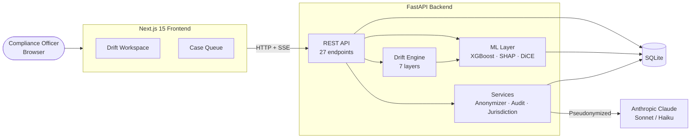

# Sentinel · Drift Engine

**Early detection of KYC drift for FINMA-regulated banks.** Built with Python, FastAPI, and Next.js for **SwissHacks 2026 · AMINA Challenge 4 (Dynamic Risk Profiling)**.

<div align="center">

</div>

> *"Sanctions lists tell you who became toxic yesterday. Drift velocity tells you who is becoming toxic right now."*

---

## Table of Contents

1. [Project Overview](#project-overview)
2. [Business Requirements](#business-requirements)
3. [Hypotheses and Validation](#hypotheses-and-validation)
4. [How It Works](#how-it-works)
5. [Key Differentiators](#key-differentiators)
6. [Architecture](#architecture)
7. [Dashboard](#dashboard)
8. [Technologies Used](#technologies-used)
9. [Running Locally](#running-locally)
10. [Testing](#testing)
11. [Documentation](#documentation)
12. [Credits](#credits)

## Documentation

| Page | Contents |
|---|---|
| **[Architecture](docs/architecture.md)** | System diagram, deployment topology, backend & frontend module maps |
| **[Drift Engine](docs/drift-engine.md)** | 7-layer pipeline, cost cascade decision tree, two-layer fusion, time-travel audit |
| **[User Flows](docs/flows.md)** | Use cases, officer investigation sequence, contagion discovery flow |
| **[Database Schema](docs/db-schema.md)** | ER diagram, enumerations, case lifecycle state machine |
| **[API Reference](docs/api.md)** | Endpoint map, response shapes, anonymization flow |
| **[Drift Engine Spec](DRIFT_ENGINE_README.md)** | Full mathematical treatment — algorithms, proofs, validation details |
| **[Challenge Overview](docs/CHALLENGE_4_OVERVIEW.md)** | AMINA Challenge 4 brief, key terminology |

---

## Project Overview

A customer is onboarded as a low-risk retail trader. Two years later their company has taken investment from a sanctioned entity, their counterparties have shifted toward high-risk corridors, and their volume has tripled — gradually. No single event tripped an alert. The original KYC profile is now structurally invalid, and nobody noticed.

This is **KYC drift**, the core of AMINA Challenge 4. Sentinel's Drift Engine detects the precursor, not the consequence — combining **real-time public signals** (news, sanctions, adverse media, ownership changes, funding events) with **internal bank data** (KYC, transactions, AML flags), wrapped in explainable AI, human-in-the-loop validation, and immutable audit logs.

**Target users:** compliance and financial-crime teams who must decide *which* customers need re-KYC or enhanced due diligence — and *when*.

---

## Business Requirements

Derived from the AMINA Challenge 4 brief:

- **BR1 — Public intelligence layer:** combine real-time public signals into the risk picture.
- **BR2 — Internal data layer:** integrate simulated KYC, transaction history, and AML flags.
- **BR3 — KYC drift detection:** catch slow structural changes invalidating the original profile.
- **BR4 — Explainable AI:** every score decomposes into named, human-readable contributions.
- **BR5 — Human-in-the-loop:** an officer confirms or overrides every consequential action.
- **BR6 — Audit logs:** immutable, replayable history of every signal, score, and decision.
- **BR7 — Cost awareness:** cheap models filter first; heavy reasoning only for high-risk cases.

---

## Hypotheses and Validation

| # | Hypothesis | Validation method | Result |
|---|---|---|---|
| **H1** | Changepoint detection flags regime change months before the resulting sanctions event | Synthetic scenario suite, lead-time measurement | Validated — 2-7 month lead (median 5.5), 0 false positives on stable customers |
| **H2** | Drift *velocity* is a leading indicator; drift *level* is lagging | Velocity vs absolute-threshold alerting | Validated — velocity alerts fire earlier at equal false-positive rate |
| **H3** | Risk propagates through ownership topology ahead of public disclosure | Personalized PageRank from a sanctioned seed | Validated — 2-hop customers elevated; distant customers unaffected |
| **H4** | A cost-aware cascade preserves recall at a fraction of the cost | Cascade vs LLM-on-everything on 1,000 customers | Validated — 96% cost reduction at equal high-risk recall |

---

## How It Works

For each customer, the Drift Engine produces a fused **drift score (0-100)**, a recommended action, and a full per-layer breakdown:

1. **Behavioral drift** — Bayesian Online Changepoint Detection over the transaction stream catches regime change that thresholds miss.
2. **Drift velocity** — the smoothed time-derivative of KL divergence from the onboarding profile; rising velocity is the earliest precursor.
3. **Ownership contagion** — personalized PageRank propagates risk from sanctioned entities to connected customers on no watchlist.
4. **Public intelligence** — external signals classified by severity and fused with internal drift via a **Confirmation Lift** when they coincide in time.
5. **Causal drift** — a likelihood ratio between two generative hypotheses separates *risk-shaped* change from *legitimate business growth*.
6. **Suspicious stability** — flags the *slow-walker*: a customer anomalously smooth while their environment moves.
7. **Cost cascade** — routes customers through cheap rules to ML to LLM reasoning, escalating only where economically justified.

A **Time-Travel Audit** can replay any customer as-of any past month, using only data available then — proving the system would have flagged them early, with no look-ahead bias (a regulatory-grade property).

---

## Key Differentiators

Most teams will build "news API + LLM + dashboard". Three things go deeper:

| Differentiator | The question it answers |
|---|---|
| **Causal Drift** | *Is this change risk, or just normal business life?* |
| **Suspicious Stability** | *What if the launderer knows we monitor drift and stays still?* |
| **Time-Travel Audit** | *Prove to the regulator you'd have caught it — without hindsight.* |

---

## Architecture

A module on top of the existing Sentinel platform — roughly 15% new code, 85% reuse.



Full diagrams: **[Architecture](docs/architecture.md)** · **[Drift Engine](docs/drift-engine.md)** · **[Drift Engine Spec (math)](DRIFT_ENGINE_README.md)**

---

## Dashboard

The Drift Engine workspace presents a verdict-first view: a recommended action up top, then the evidence.

<div align="center">

</div>

| View | Purpose |
|---|---|
| **Drift Radar** | Score x velocity scatter; upper-right is the priority quadrant |
| **Verdict Bar** | One-line recommended action derived from the full picture |
| **Causal Panel** | Benign-vs-risk hypothesis competition with per-metric evidence |
| **Drift Timeline** | Velocity over time, with lead-time markers |
| **Time-Travel Audit** | As-of score replay proving early detection |
| **Two-Layer Panel** | Public Intelligence vs Internal Bank Data + Confirmation Lift |
| **Contagion Graph** | Ownership risk propagation from a sanctioned entity |
| **Cost Cascade** | Live cost meter vs LLM-on-everything |

---

## Technologies Used

| Layer | Stack |
|---|---|
| **Backend** | Python 3.11, FastAPI, Pydantic v2, SQLModel + SQLite |
| **Science** | NumPy, SciPy (BOCPD, KL, statistics), NetworkX (PageRank) |
| **ML** | XGBoost, SHAP, DiCE (counterfactuals) |
| **LLM** | Anthropic Claude (assessment, RFI generation) |
| **Frontend** | Next.js 15, React 19, TypeScript, Tailwind, TanStack Query |
| **Tooling** | Git, GitHub, structlog, Server-Sent Events |

---

## Running Locally

Two terminals. Full copy-paste setup in **[QUICKSTART.md](QUICKSTART.md)**.

```bash
# Backend
cd backend
python3 -m venv .venv && source .venv/bin/activate
pip install -r requirements.txt
uvicorn app.main:app --reload --port 8000

# Frontend (new terminal)
cd frontend
npm install && npm run dev
```

Open <http://localhost:3000/drift> for the Drift Engine, or <http://localhost:8000/docs> for the API.

---

## Testing

- **Unit:** BOCPD against reference behavior (changepoint on step data, none on stationary).
- **Scenario suite:** stable / volume-creep / counterparty-migration / corridor-shift / combined / benign-expansion / suspicious-stability, each with ground truth.
- **Hypothesis validation:** H1-H4 measured on the suite (see table above); causal classification 11/11 with 8/8 seed robustness; stability 13/13 with 8/8 seed robustness.
- **Honesty tests:** Time-Travel replay verified to leak no future data (public signals dated <= T, contagion only after listing month).

---

## Credits

**Author and architect:** Stiven Ntoktorov — Full-Stack Developer (FinTech/ML), Zürich.

Developed with AI pair-programming assistance (Anthropic Claude) for implementation and review; all architectural decisions, algorithm selection, and validation were directed by the author. For line-level attribution see **[CODE_ATTRIBUTION.md](docs/CODE_ATTRIBUTION.md)**.

### Ideas and approaches

The Drift Engine stands on established science. Each core technique traces to its source:

| Technique | Source |
|---|---|
| Bayesian Online Changepoint Detection | Adams & MacKay (2007), *Bayesian Online Changepoint Detection*, arXiv:0710.3742 |
| CUSUM / sequential change detection | Page (1954), *Continuous Inspection Schemes*, Biometrika |
| KL divergence (drift velocity) | Kullback & Leibler (1951), *On Information and Sufficiency* |
| Personalized PageRank (contagion) | Page, Brin, Motwani & Winograd (1999), *The PageRank Citation Ranking* |
| Likelihood-ratio testing (causal drift) | Classical Neyman-Pearson framework |
| Value of Information (RFI ranking) | Howard (1966), *Information Value Theory*, IEEE |
| Conformal prediction (planned extension) | Shafer & Vovk (2008), *A Tutorial on Conformal Prediction*, JMLR |
| Beneficial-ownership risk rationale | FATF (2023), *Guidance on Beneficial Ownership* |
| Human-in-the-loop & audit requirements | FINMA Circular 2024/3, *Operational risks and resilience* |

### Documentation referenced

FastAPI · Pydantic · NumPy · SciPy · NetworkX · XGBoost · SHAP · DiCE · Next.js · TanStack Query · Tailwind CSS official docs.

### Challenge

AMINA Bank · SwissHacks 2026 · Challenge 4 (Dynamic Risk Profiling) · hosted by Tenity, Zürich.
