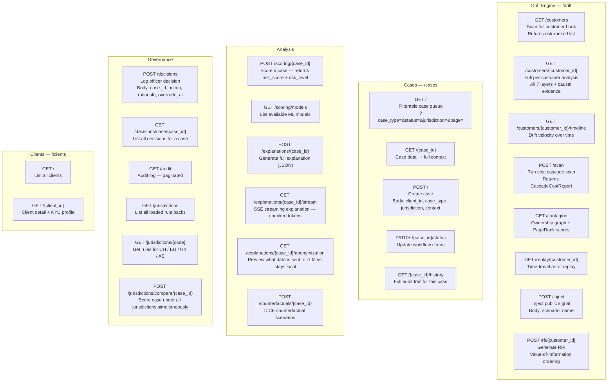
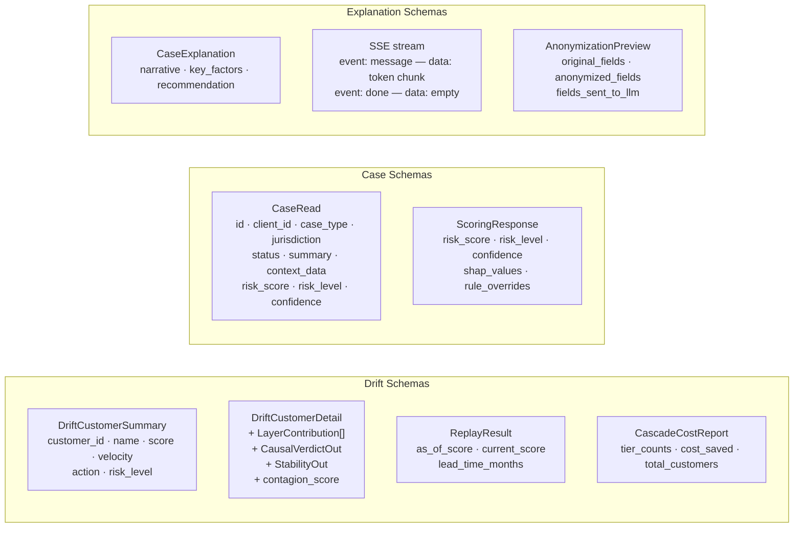
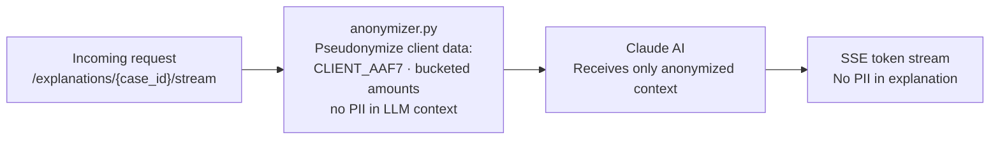

# API Reference

Base URL: `http://localhost:8000/api/v1`  
Interactive docs: `http://localhost:8000/docs`  
Total endpoints: 27

## Endpoint Map

---

## Response Shape Reference

---

## Authentication & Privacy

No auth tokens required in dev mode. All LLM calls pass through `anonymizer.py` — raw names and exact amounts never leave the backend.
