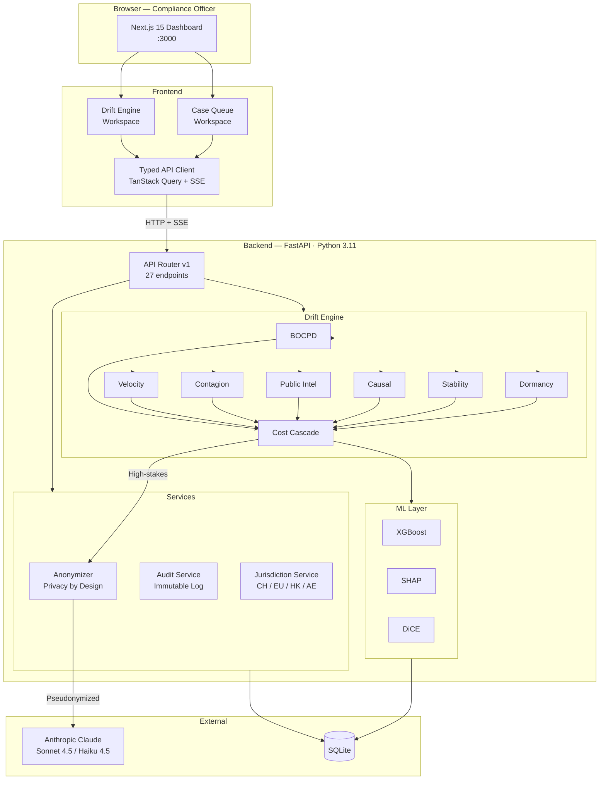
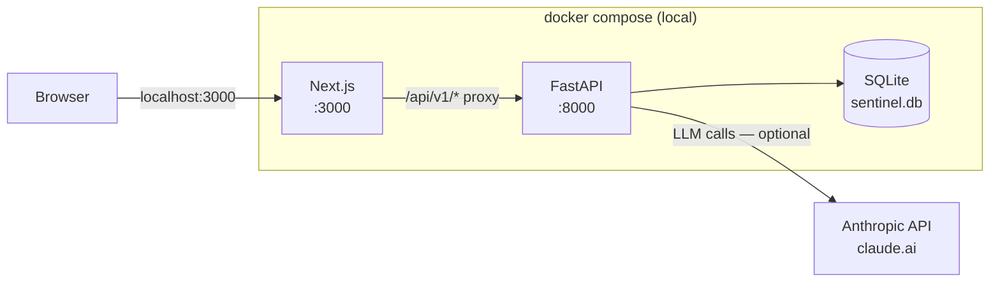
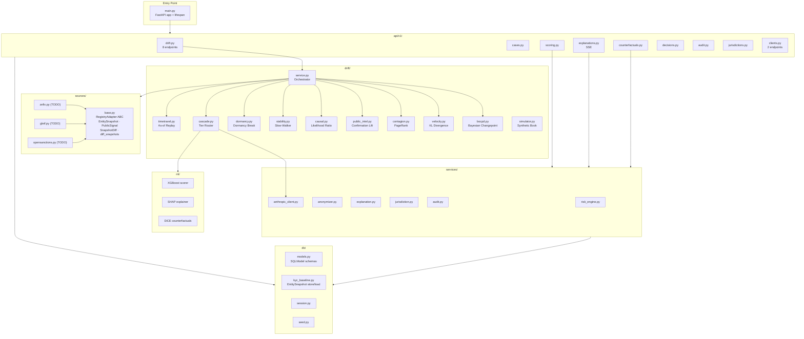

# Architecture

## System Overview

```mermaid
flowchart TB
    subgraph Browser["Browser — Compliance Officer"]
        UI["Next.js 15 Dashboard\n:3000"]
    end

    subgraph FE["Frontend"]
        DriftWS["Drift Engine\nWorkspace"]
        CaseWS["Case Queue\nWorkspace"]
        APIClient["Typed API Client\nTanStack Query + SSE"]
    end

    subgraph BE["Backend — FastAPI · Python 3.11"]
        Router["API Router v1\n27 endpoints"]

        subgraph Svcs["Services"]
            AnonSvc["Anonymizer\nPrivacy by Design"]
            AuditSvc["Audit Service\nImmutable Log"]
            JurisSvc["Jurisdiction Service\nCH / EU / HK / AE"]
        end

        subgraph DE["Drift Engine"]
            BOCPD[BOCPD]
            Vel[Velocity]
            Con[Contagion]
            PI[Public Intel]
            Caus[Causal]
            Stab[Stability]
            Dorm[Dormancy]
            Casc[Cost Cascade]
        end

        subgraph ML["ML Layer"]
            XGB[XGBoost]
            SHAP[SHAP]
            DiCE[DiCE]
        end
    end

    subgraph Ext["External"]
        Claude["Anthropic Claude\nSonnet 4.5 / Haiku 4.5"]
        DB[(SQLite)]
    end

    UI --> DriftWS & CaseWS
    DriftWS & CaseWS --> APIClient
    APIClient -->|HTTP + SSE| Router
    Router --> Svcs & DE
    DE --> BOCPD & Vel & Con & PI & Caus & Stab & Dorm
    BOCPD & Vel & Con & PI & Caus & Stab & Dorm --> Casc
    Casc --> ML
    Casc -->|High-stakes| AnonSvc
    AnonSvc -->|Pseudonymized| Claude
    Svcs & ML --> DB
```

---

## Deployment Topology

```mermaid
flowchart LR
    Browser[Browser]

    subgraph Local["docker compose (local)"]
        NextJS["Next.js\n:3000"]
        FastAPI["FastAPI\n:8000"]
        SQLite[("SQLite\nsentinel.db")]
    end

    AnthropicAPI["Anthropic API\nclaude.ai"]

    Browser -->|localhost:3000| NextJS
    NextJS -->|/api/v1/* proxy| FastAPI
    FastAPI --> SQLite
    FastAPI -->|LLM calls — optional| AnthropicAPI
```

---

## Backend Module Map

```mermaid
flowchart TD
    subgraph Entry["Entry Point"]
        Main["main.py\nFastAPI app + lifespan"]
    end

    subgraph API["api/v1/"]
        R1["drift.py\n8 endpoints"]
        R2[cases.py]
        R3[scoring.py]
        R4["explanations.py\nSSE"]
        R5[counterfactuals.py]
        R6[decisions.py]
        R7[audit.py]
        R8[jurisdictions.py]
        R9["clients.py\n2 endpoints"]
    end

    subgraph Core["drift/"]
        bocpd["bocpd.py\nBayesian Changepoint"]
        velocity["velocity.py\nKL Divergence"]
        contagion["contagion.py\nPageRank"]
        pubintel["public_intel.py\nConfirmation Lift"]
        causal["causal.py\nLikelihood Ratio"]
        stability["stability.py\nSlow-Walker"]
        dormancy["dormancy.py\nDormancy Break"]
        cascade["cascade.py\nTier Router"]
        timetravel["timetravel.py\nAs-of Replay"]
        simulator["simulator.py\nSynthetic Book"]
        service["service.py\nOrchestrator"]
    end

    subgraph ML["ml/"]
        xgb[XGBoost scorer]
        shap_m[SHAP explainer]
        dice_m[DiCE counterfactuals]
    end

    subgraph Svc["services/"]
        risk[risk_engine.py]
        anon[anonymizer.py]
        expl[explanation.py]
        jur[jurisdiction.py]
        aud[audit.py]
        claude_c[anthropic_client.py]
    end

    subgraph Data["db/"]
        models["models.py\nSQLModel schemas"]
        kyc_baseline["kyc_baseline.py\nEntitySnapshot store/load"]
        session[session.py]
        seed[seed.py]
    end

    subgraph Sources["sources/"]
        src_base["base.py\nRegistryAdapter ABC\nEntitySnapshot · PublicSignal\nSnapshotDiff · diff_snapshots"]
        src_zefix["zefix.py (TODO)"]
        src_gleif["gleif.py (TODO)"]
        src_opensanc["opensanctions.py (TODO)"]
    end

    Main --> API
    R1 --> service
    service --> bocpd & velocity & contagion & pubintel & causal & stability & dormancy & cascade & timetravel
    cascade --> ML & claude_c
    R3 & R4 & R5 --> Svc
    Svc & API --> Data
    src_zefix & src_gleif & src_opensanc --> src_base
    service --> Sources
```

---

## Frontend Component Map

```mermaid
flowchart TD
    subgraph Pages["Pages — app/"]
        P1["page.tsx\nCase Queue Workspace"]
        P2["drift/page.tsx\nDrift Engine Workspace"]
        P3["about/page.tsx\nGitHub Showcase"]
    end

    subgraph DriftComp["components/drift/"]
        DriftRadar["DriftRadar\nScore × Velocity scatter"]
        DriftTimeline["DriftTimeline\nVelocity over time"]
        CausalPanel["CausalPanel\nHypothesis competition"]
        ContagionGraph["ContagionGraph\nOwnership propagation"]
        StabilityPanel["StabilityPanel\nSlow-walker details"]
        TimeTravelPanel["TimeTravelPanel\nAs-of replay"]
        TwoLayerPanel["TwoLayerPanel\nPublic Intel vs Bank Data"]
    end

    subgraph CaseComp["components/cases/"]
        CaseQueue["CaseQueue\nRisk-sorted list"]
        CaseDetail["CaseDetailPanel\nRight-pane orchestrator"]
        StreamExpl["StreamingExplanation\nSSE typing effect"]
        SHAPViewer["SHAPViewer\nFeature importance"]
        CFViewer["CounterfactualsViewer\nDiCE cards"]
        JurisSelect["JurisdictionSelector\nCH/EU/HK/AE toggle"]
        PrivacyPanel["PrivacyPanel\nBank data vs AI data"]
        DecisionBar["DecisionBar\nOfficer action + rationale"]
    end

    subgraph Lib["lib/"]
        APIClient["api.ts\nTyped fetch wrapper"]
        SSEHook["useStreamingText\nSSE hook"]
        Utils["utils.ts\nShared utilities"]
    end

    P1 --> CaseQueue & CaseDetail
    P2 --> DriftRadar & DriftTimeline & CausalPanel & ContagionGraph & StabilityPanel & TimeTravelPanel & TwoLayerPanel
    CaseDetail --> StreamExpl & SHAPViewer & CFViewer & JurisSelect & PrivacyPanel & DecisionBar
    Pages & DriftComp & CaseComp --> APIClient & SSEHook
```
