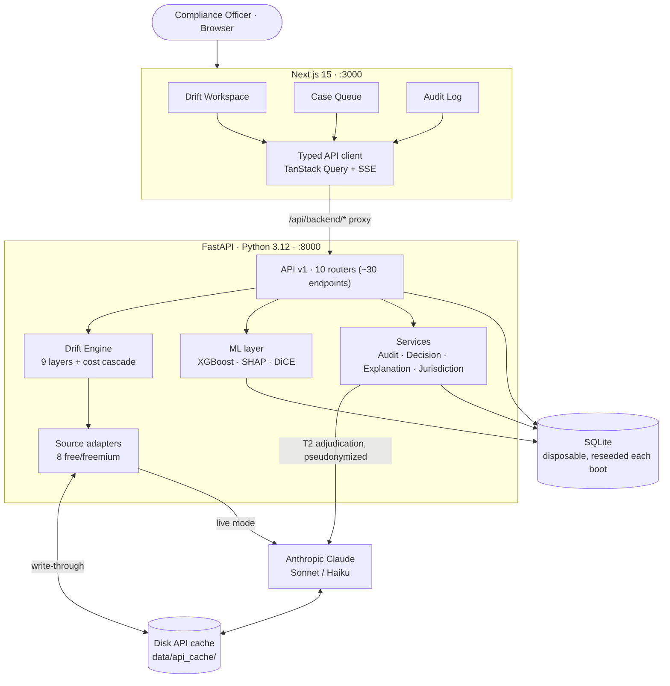
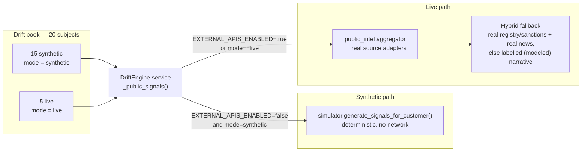
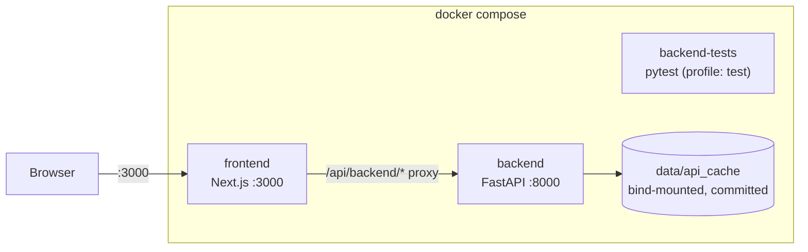

# Architecture

Sentinel is a Next.js 15 frontend talking to a FastAPI backend over HTTP + SSE,
backed by a disposable SQLite database, with Anthropic Claude used only for the
T2 adjudication tier. Everything runs from one `docker compose` file.

## System overview



The frontend never calls external APIs directly: `next.config.mjs` rewrites
`/api/backend/:path*` to the backend (`http://backend:8000` in Docker, localhost
otherwise).

---

## Two modes, one engine

The single most important architectural idea: the same Drift Engine runs on
**synthetic** or **live** data, decided per request.



- **`EXTERNAL_APIS_ENABLED`** (env, default `false`) is the global switch — the
  whole book stays offline/synthetic.
- **`mode="live"`** on an individual `SyntheticCustomer` overrides that switch for
  that one subject, so 5 real companies fire real adapters while the rest stay
  synthetic and free.
- **Hybrid fallback** (live path): registry/screening signals (GLEIF, OpenSanctions,
  WHOIS) are reliable, but live news feeds are often sparse, so the engine prefers
  real recent articles and only falls back to a clearly-labelled `(modeled)`
  scenario narrative when the live feed returns nothing — it never invents a fake
  source link.

See [sources.md](sources.md) and [live-entities.md](live-entities.md) for detail.

---

## Disk API cache

`core/api_cache.py` (`DiskCache`) is a write-through JSON cache under
`backend/data/api_cache/{service}/{key}.json`, **committed to the repo** so live
entities replay fully offline.

- **Miss** → live call (when enabled + keyed), response saved immediately.
- **Hit** → instant read, zero tokens, zero cost.
- **Disabled under pytest** (`PYTEST_CURRENT_TEST` / `API_CACHE_DISABLED`) so unit
  tests see their mocked HTTP, not stale disk data.

Cached services: `gleif`, `event_registry`, `opensanctions`, `gdelt`, `wayback`,
`whois`, `firecrawl`, and `anthropic` (LLM completions — real T2 adjudications and
UC9 website-diff summaries replay offline). After a one-time pre-warm, the demo
needs no network and spends no tokens.

---

## Backend module map

```
backend/app/
├── main.py                 FastAPI app + lifespan (init DB, seed, load models)
├── api/v1/                 10 routers (~30 endpoints)
│   ├── drift.py            subjects, scan, contagion, replay, inject, rfi
│   ├── cases.py            case queue + status + history
│   ├── clients.py          client list/detail
│   ├── decisions.py        record/list compliance decisions (case + drift)
│   ├── audit.py            paginated, filterable audit log
│   ├── scoring.py          ML scoring of cases
│   ├── explanations.py     LLM explanation (incl. SSE streaming)
│   ├── counterfactuals.py  DiCE alternative scenarios
│   ├── jurisdictions.py    CH / EU / HK / AE rule packs
│   └── config.py           operating mode (synthetic/live, llm_mode, adapters)
├── drift/                  THE ENGINE
│   ├── bocpd.py            Bayesian Online Changepoint Detection
│   ├── velocity.py         drift velocity (KL-divergence derivative)
│   ├── contagion.py        ownership PageRank
│   ├── causal.py           risk-vs-benign likelihood ratio
│   ├── stability.py        suspicious-stability (slow-walker)
│   ├── dormancy.py         dormancy-break (sleeper)
│   ├── business_model.py   Wayback↔Firecrawl website-drift (model2vec)
│   ├── public_intel.py     external-signal aggregator + confirmation lift
│   ├── cascade.py          T0 rules → T1 ML → T2 LLM router
│   ├── timetravel.py       as-of replay (no look-ahead)
│   ├── service.py          orchestrator: fuses layers → score + floors
│   └── simulator.py        synthetic book + live-entity definitions
├── sources/                base.py · cost.py · registry.py + 8 adapters
│                           (+ open_corporates, crunchbase = skipped/paid)
├── services/               anthropic_client · audit · decision · explanation
│                           · jurisdiction · risk_engine · mock_data · prompts
├── ml/                     base (XGBoost) · registry · training
├── db/                     models · kyc_baseline · session · seed · seed_audit
└── core/                   config · api_cache · logging
```

The score-fusion and regulatory floors live in `drift/service.py`; the layer
math is documented in [drift-engine.md](drift-engine.md).

---

## Frontend map

```
frontend/src/app/
├── page.tsx                /          → Drift Workspace (home)
├── drift/[driftId]/page.tsx /drift/<id> → deep-linked subject
├── cases/page.tsx          /cases     → Case Queue
├── audit/page.tsx          /audit     → Audit Log (filterable)
└── about/page.tsx          /about
```

**Drift panels** (`components/drift/`): `DriftRadar` (score × velocity),
`DriftTimeline` (velocity + BOCPD marker), `CausalPanel`, `StabilityPanel`,
`DormancyPanel`, `TimeTravelPanel`, `TwoLayerPanel` (public vs internal +
confirmation lift), `ContagionGraph`, `UboScreeningPanel` (UC8),
`WebsiteDiffPanel` (UC9 — AI summary + archived/live links), plus the inline
**cost-cascade** meter.
**Case components** (`components/cases/`): `CaseQueue`, `CaseDetailPanel`,
`DecisionBar`, `CounterfactualsViewer`, streaming explanation.
**Shared**: `DemoModeBadge` reflects per-entity mode (SYNTHETIC / LIVE) and the
live-AI status.

---

## Deployment topology



SQLite is **disposable by design**: on every backend boot the schema is dropped
and recreated, then `db/seed.py` + `db/seed_audit.py` repopulate it — 20 KYC
baselines, 10 clients, 19 cases, and a ~97-entry backdated audit trail. There is
no migration story because there is no persistent state to migrate; the committed
`data/api_cache/` is the only durable artifact, and it holds real cached API
responses for the live entities. Tests run against an in-memory SQLite via the
`backend-tests` service (`docker compose run --rm backend-tests`).
