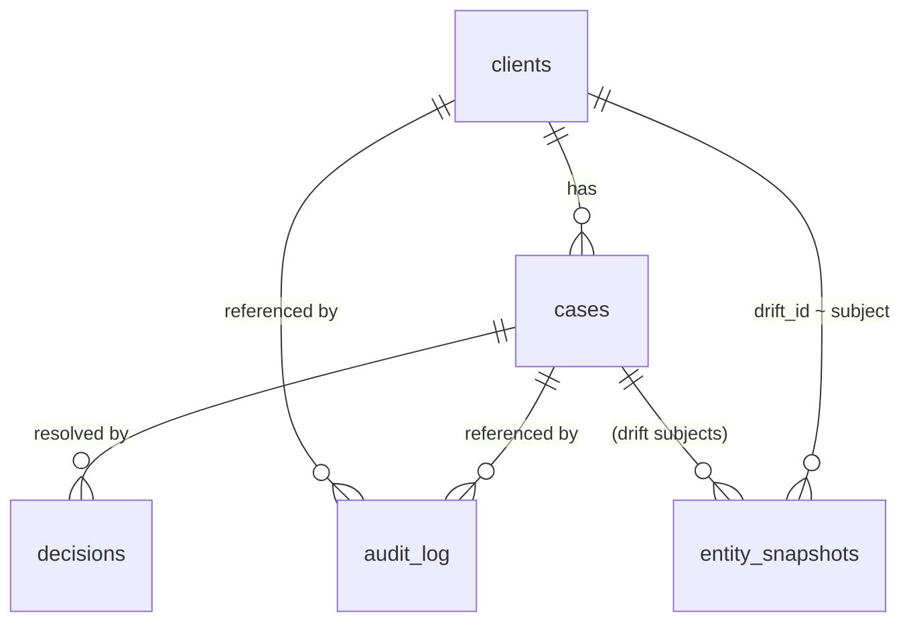

# Data Model

The persistence layer is **SQLModel on SQLite** (`backend/app/db/`). SQLite is
treated as **disposable demo state**: the schema is dropped, recreated, and
re-seeded on every backend startup (`db/session.py:init_db`). Two design rules
run through every table:

- **Append-only where it matters.** `decisions`, `audit_log`, and
  `entity_snapshots` are never updated or deleted — a change is a new row. This is
  the compliance backbone: the history *is* the audit trail.
- **JSON columns for heterogeneous payloads.** Case context, decision snapshots,
  audit payloads, and raw adapter responses vary by type, so they live in JSON
  columns rather than rigid schemas.

DB models (`db/models.py`, `db/kyc_baseline.py`) are deliberately separate from
the API request/response schemas (`schemas/`) so storage and contract evolve
independently.

> `entity_snapshots.drift_id` is a free string (`"drift-001"`, `"drift-live-002"`,
> or a `ClientDB` UUID), so the table serves both the Drift Engine's synthetic
> subjects and case-management clients.

---

## Tables

### `clients` — `ClientDB`
The bank customer under review.

| Field | Type | Notes |
|---|---|---|
| `id` | UUID PK | |
| `full_name` | str (indexed) | |
| `email`, `nationality`, `residence_country` | str \| None | |
| `primary_jurisdiction` | `Jurisdiction` (indexed) | CH / EU / HK / AE |
| `risk_tolerance` | str | e.g. `balanced`, `aggressive` |
| `aum_chf` | float | assets under management |
| `esg_focus` | bool | |
| `is_pep` | bool (indexed) | politically exposed person |
| `sanctions_check_passed` | bool | last screening result |
| `onboarded_at` | date | |
| `last_review_date` | date \| None | |
| `profile_data` | dict (JSON) | heterogeneous profile fields |
| `created_at`, `updated_at` | datetime | |

### `cases` — `CaseDB`
A specific item under compliance review.

| Field | Type | Notes |
|---|---|---|
| `id` | UUID PK | |
| `client_id` | UUID FK → `clients.id` (indexed) | |
| `case_type` | `CaseType` (indexed) | see enum below |
| `jurisdiction` | `Jurisdiction` (indexed) | |
| `status` | `CaseStatus` (indexed) | default `pending` |
| `summary` | str | denormalized for list views |
| `context_data` | dict (JSON) | type-specific payload (transcript, transaction, …) |
| `risk_score` | float \| None (indexed) | filled after ML scoring |
| `risk_level` | str \| None (indexed) | |
| `confidence` | float \| None | 0..1 |
| `assigned_to` | str \| None | officer id |
| `created_at`, `updated_at`, `scored_at`, `resolved_at` | datetime | |

### `decisions` — `DecisionDB`  *(append-only)*
A compliance officer's action on a **case** or a **drift subject**. A DB
`CHECK` constraint enforces that **exactly one** of `case_id` / `drift_id` is set
(`(case_id IS NULL) != (drift_id IS NULL)`).

| Field | Type | Notes |
|---|---|---|
| `id` | UUID PK | |
| `case_id` | UUID FK \| None | XOR with `drift_id` |
| `drift_id` | str \| None | e.g. `"drift-011"` |
| `action` | `DecisionAction` | allow / step_up_verification / escalate / block |
| `officer_id` | str (indexed) | |
| `rationale` | str \| None | required when overriding the AI |
| `overrode_ai` | bool | true when `action ≠ ai_recommended_action` |
| `ai_recommended_action` | `DecisionAction` \| None | snapshot of the AI suggestion |
| `ai_risk_score`, `ai_risk_level` | float / str \| None | AI state at decision time |
| `analysis_snapshot` | dict (JSON) | full engine state captured at decision time |
| `created_at` | datetime (indexed) | immutable |

### `audit_log` — `AuditEntryDB`  *(append-only)*
The immutable record of every meaningful event — the compliance backbone.

| Field | Type | Notes |
|---|---|---|
| `id` | UUID PK | |
| `event_type` | str (indexed) | `drift_subject_analyzed`, `drift_scan_completed`, `drift_decision_recorded`, `decision_recorded`, `case_scored`, `case_status_updated`, `explanation_generated`, `drift_rfi_generated`, … |
| `case_id`, `client_id`, `drift_id` | (indexed) | what the event relates to |
| `actor_id` | str \| None (indexed) | officer id, or `None` for system events |
| `actor_type` | str | `system` \| `compliance_officer` \| `rm` \| `client` |
| `payload` | dict (JSON) | event-specific data |
| `risk_score`, `risk_level` | (indexed) | denormalized for fast filtering |
| `occurred_at` | datetime (indexed, UTC) | event timestamp |

The `GET /api/v1/audit` endpoint filters on `event_type`, `actor_id`,
`drift_id`, `case_id`, `risk_level`, and a `from_date`/`to_date` range.

### `entity_snapshots` — `EntitySnapshotDB`  *(append-only)*
A point-in-time **KYC baseline** for a drift subject. Source adapters insert a
new row when they detect a change; the drift engine diffs the latest snapshot
against the onboarding snapshot. A composite index `(drift_id, created_at)` makes
"latest snapshot" and "onboarding baseline" index-only scans.

| Field | Type | Notes |
|---|---|---|
| `id` | UUID PK | |
| `drift_id` | str | `"drift-001"` / `"drift-live-002"` / client UUID |
| `snapshot_date` | date | |
| `snapshot_type` | str | `onboarding` \| `annual_review` \| `triggered` \| `seeded` (CHECK) |
| `source` | str | `internal` \| `zefix` \| `gleif` \| `opensanctions` \| `event_registry` \| `firecrawl` \| `wayback` \| `whois` \| … (CHECK) |
| `name`, `legal_form`, `jurisdiction`, `registered_address` | | legal identity |
| `dissolution_status` | str \| None | `active` \| `dissolved` \| `dormant` \| `struck_off` |
| `beneficial_owners`, `officers` | list (JSON) | ownership / control (names, LEIs) |
| `risk_tolerance`, `aum_chf`, `is_pep`, `sanctions_check_passed` | | financial / compliance profile |
| `avg_monthly_volume_chf` | float \| None | behavioral baseline (onboarding window) |
| `counterparty_risk_mean` | float \| None | mean counterparty-risk 0–1 |
| `corridor_risk_mean` | float \| None | mean corridor-risk 0–1 |
| `margin_ratio_mean` | float \| None | mean margin ratio 0–1 (causal discriminator) |
| `raw_data` | dict (JSON) | full adapter payload: `domain`, `onboarding_date`, embedding cache, etc. |
| `created_at` | datetime (indexed) | |

---

## Enums (`schemas/enums.py`)

| Enum | Values |
|---|---|
| `Jurisdiction` | `CH` (FINMA), `EU` (MiCA), `HK` (SFC), `AE` (FSRA) |
| `CaseType` | `social_engineering`, `portfolio_risk`, `investment_recommendation`, `client_onboarding`, `xrpl_transaction`, `kyc_drift` |
| `RiskLevel` | `low` (0–30), `medium` (31–60), `high` (61–85), `critical` (86–100) |
| `DecisionAction` | `allow`, `step_up_verification`, `escalate`, `block` |
| `CaseStatus` | `pending`, `in_review`, `resolved`, `expired` |

---

## Seeding

`db/seed.py` (+ `db/seed_audit.py`) run on every startup via `seed_if_empty()`.
Each path is **idempotent** (skips if its table is non-empty) and the DB is
recreated each boot, so a fresh demo is identical every time.

**Path 1 — KYC baselines** (`_seed_kyc_baselines`). One `seeded` onboarding
snapshot per drift subject from `drift/simulator.py:generate_book()` →
**20 `entity_snapshots`** (15 synthetic + 5 live). Behavioral baselines are
computed from each customer's pre-drift window; live entities also carry `domain`
and `onboarding_date` (`"20220101"`) in `raw_data` for the UC9 Wayback lookup.

**Path 2 — Case queue** (`_seed_case_queue`, from `services/mock_data.py`).
**10 clients** + **19 cases**: 8 social-engineering, 4 investment-recommendation,
6 XRPL-transaction. Stable UUIDs so the demo always returns the same case IDs.

**Path 3 — Audit trail** (`seed_audit.py`). **~97 backdated, deterministic**
compliance events spanning ~3 weeks: nightly system scans, per-subject analyses,
officer decisions (some overriding the AI, with rationale), and RFIs — by three
named officers (`anna.mueller`, `marc.weber`, `sophie.dubois`), a relationship
manager (`t.brunner`), and `system`. Entries reference **real** `drift_id` /
`case_id` so every audit filter works end-to-end, and the flagship **Castor Trade
Finance AG** thread reads as a real investigation (analyzed → re-analyzed → RFI →
**BLOCK + SAR**). It is **audit-only** — no `DecisionDB` rows are created, so the
DecisionBar stays empty for a live demo where the officer records a decision
themselves.

See [getting-started.md](getting-started.md) and [live-entities.md](live-entities.md)
for how the live entities and their caches are populated.
