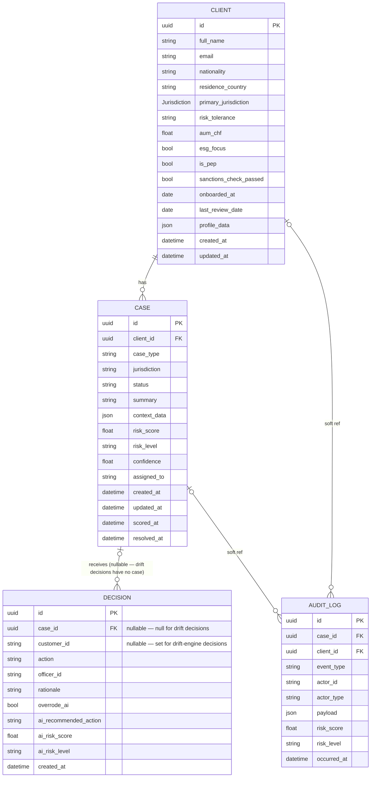
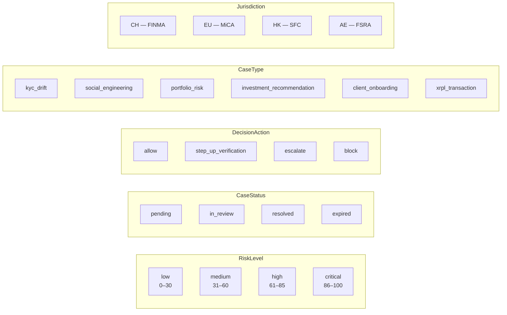
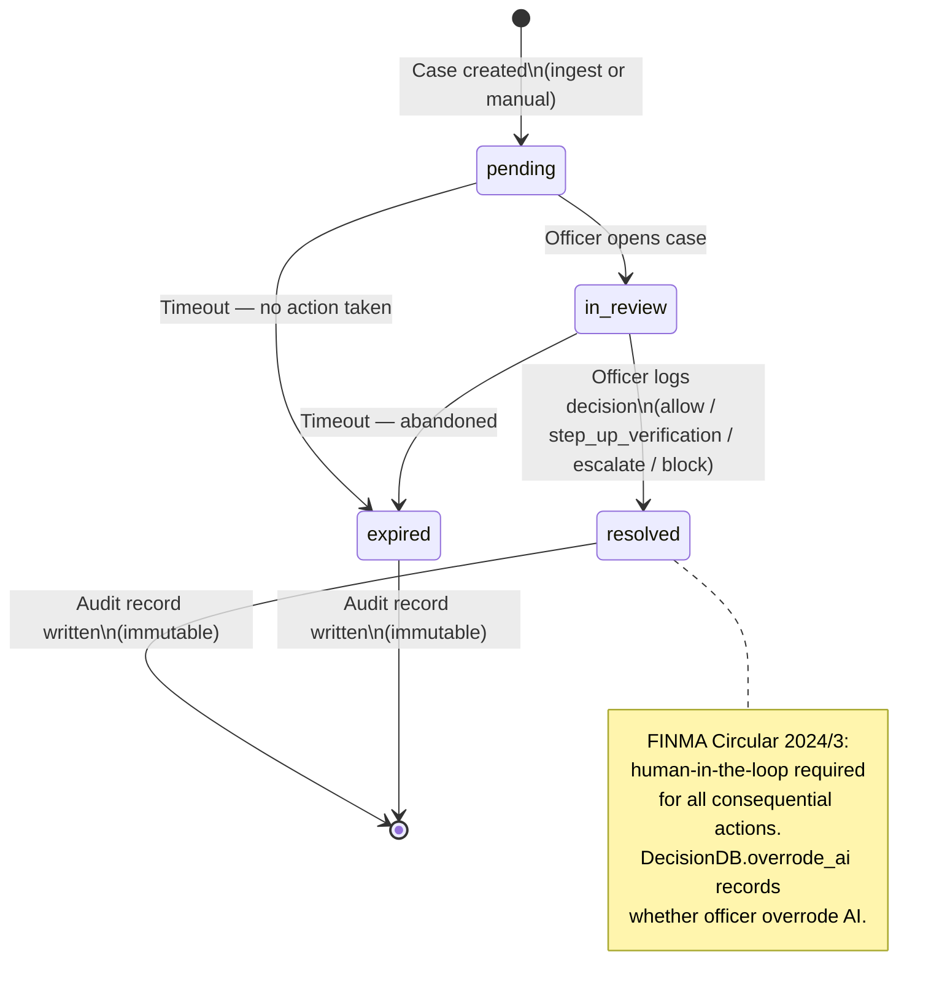

# Database Schema

## Entity Relationship Diagram

---

## Enumerations

> Jurisdiction is stored as bare code: `"CH"`, `"EU"`, `"HK"`, `"AE"`.

---

## Decision Workflows

Two distinct decision paths share the same `decisions` table:

| Field | Case-review workflow | Drift-engine workflow |
|---|---|---|
| `case_id` | Set (UUID FK → cases) | `NULL` |
| `customer_id` | `NULL` | Set (drift customer string ID) |
| `ai_recommended_action` | Derived from `case.risk_score` thresholds | Passed as `ai_hint` by the caller (VerdictBar logic) |
| Audit event type | `decision_recorded` | `drift_decision_recorded` |
| Case status updated | Yes (`resolved` / `in_review`) | No (no linked case record) |

Both paths enforce the same override rule: if `action ≠ ai_recommended_action`, a `rationale` of ≥ 10 characters is required.

---

## Data Flow: KYC Case Lifecycle

