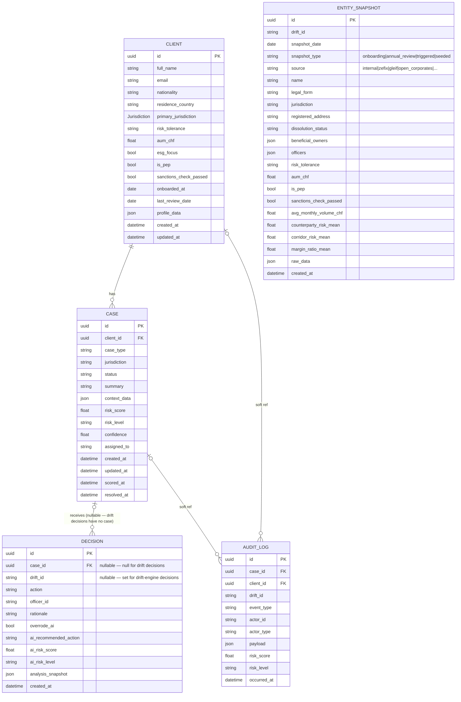
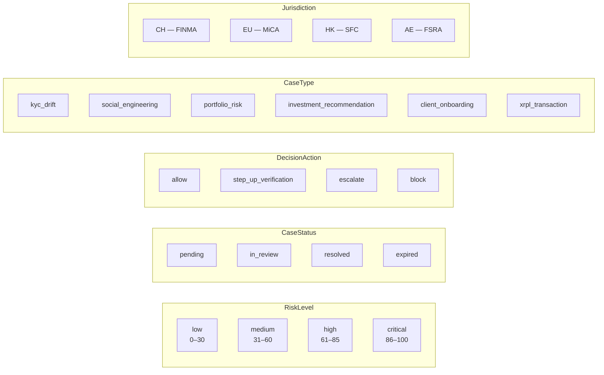
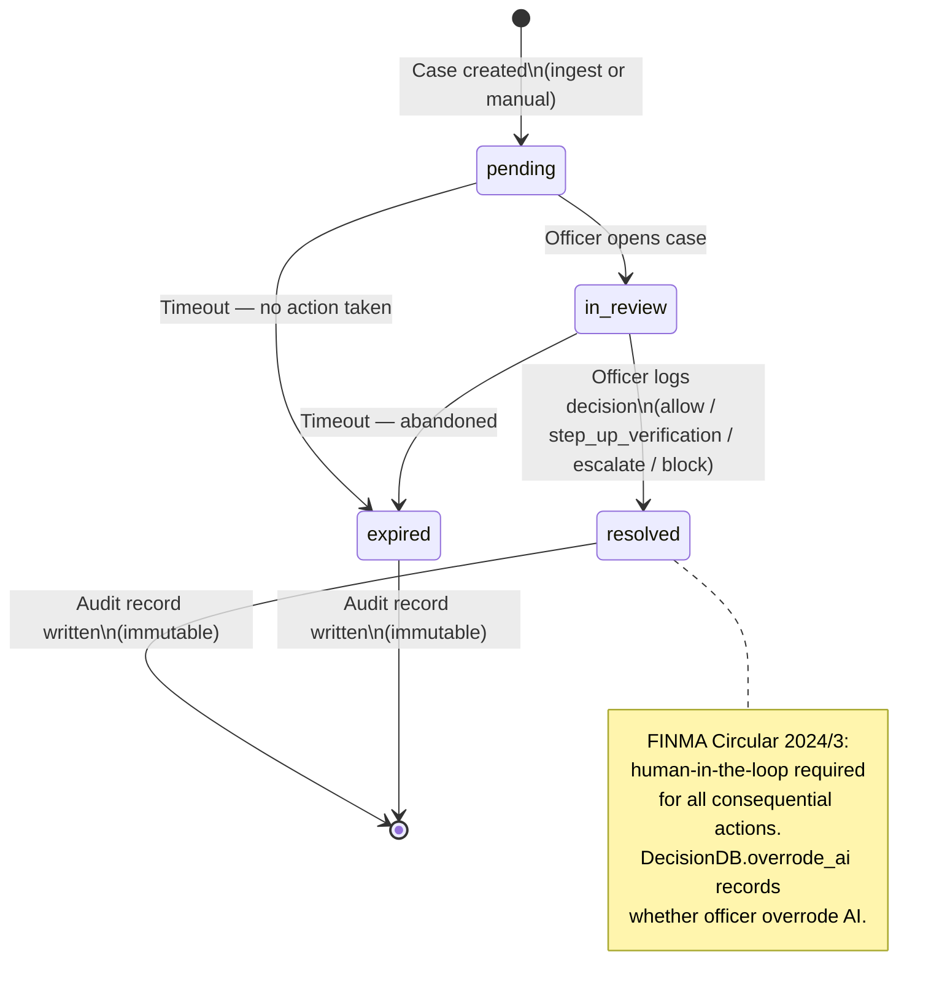

# Database Schema

## Entity Relationship Diagram

---

## Enumerations

> Jurisdiction is stored as bare code: `"CH"`, `"EU"`, `"HK"`, `"AE"`.

---

## Decision Workflows

Two distinct decision paths share the same `decisions` table:

| Field | Case-review workflow | Drift-engine workflow |
|---|---|---|
| `case_id` | Set (UUID FK → cases) | `NULL` |
| `drift_id` | `NULL` | Set (drift customer string ID) |
| `ai_recommended_action` | Derived from `case.risk_score` thresholds | Derived by the backend from the current drift analysis |
| `analysis_snapshot` | Case type, jurisdiction, confidence | Score, risk level, tier, causal evidence, stability, and analysis version |
| Audit event type | `decision_recorded` | `drift_decision_recorded` |
| Case status updated | Yes (`resolved` / `in_review`) | No (no linked case record) |

Both paths enforce the same override rule: if `action ≠ ai_recommended_action`, a `rationale` of ≥ 10 characters is required.

The SQLite schema is disposable and is dropped/recreated on every backend
startup before mock data is seeded.

---

## EntitySnapshot — KYC Baseline Store

`entity_snapshots` is an **append-only** table that records the KYC profile of
a customer at a point in time. Source adapters (ZEFIX, GLEIF, OpenCorporates,
…) write a new row whenever they detect a registry change; the drift engine
diffs the current snapshot against the onboarding baseline to flag structural
drift (name change, legal form change, UBO change, etc.).

**Lookup patterns supported:**

| Query | Function |
|---|---|
| Latest snapshot for a customer | `load_latest_snapshot(session, drift_id)` |
| Onboarding baseline | `load_onboarding_snapshot(session, drift_id)` |
| Full change history | `load_snapshot_history(session, drift_id)` |
| Book-wide latest baselines | `load_all_baselines(session)` |

**Snapshot types:**

| Type | When written |
|---|---|
| `onboarding` | At KYC onboarding (real adapter) |
| `annual_review` | During periodic re-KYC |
| `triggered` | On event (sanctions hit, news spike, etc.) |
| `seeded` | Startup seed from synthetic book (demo) |

**Behavioral baseline fields** (`avg_monthly_volume_chf`, `counterparty_risk_mean`,
`corridor_risk_mean`, `margin_ratio_mean`) are computed from the pre-drift
transaction window at seeding time and serve as numeric anchors for the drift
velocity and causal layers.

---

## Data Flow: KYC Case Lifecycle

