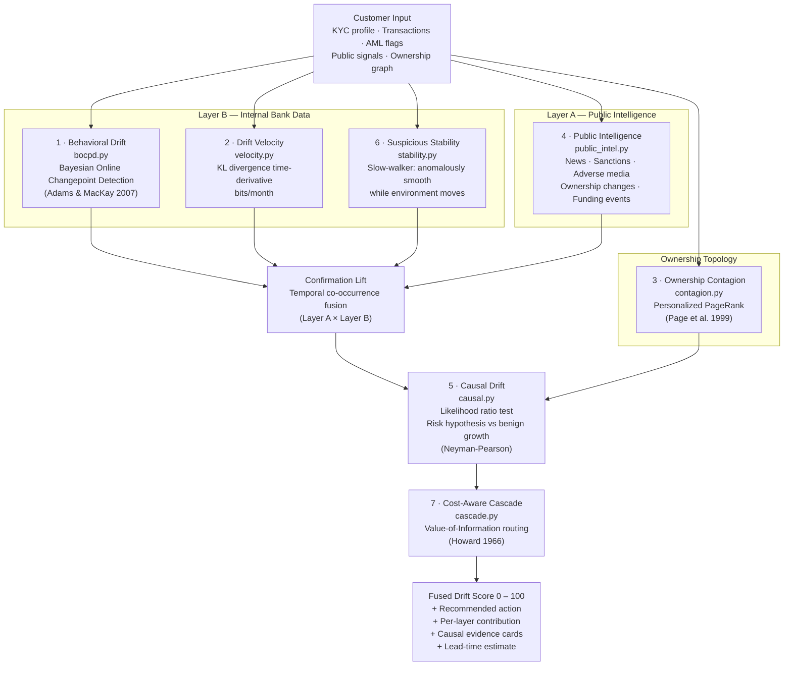
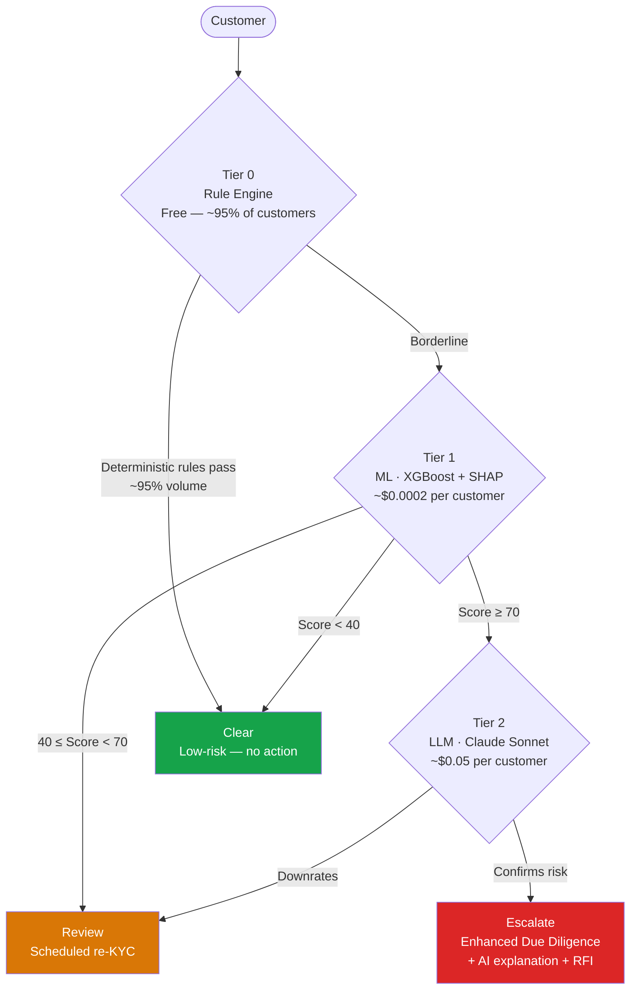
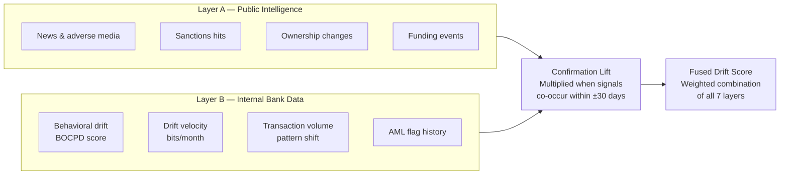
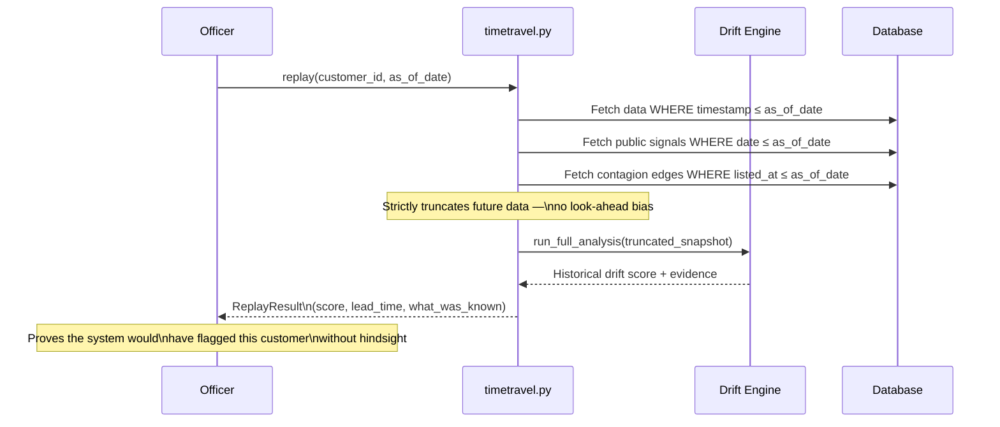

# Drift Engine

## 7-Layer Pipeline

---

## Cost-Aware Cascade (Tier Router)

**Result:** 96% cost reduction vs LLM-on-everything at equal high-risk recall (H4, validated on 1,000-customer synthetic book).

---

## Two-Layer Fusion

---

## Time-Travel Audit

---

## Validation Results

| Hypothesis | Scenario | Result |
|---|---|---|
| H1 — Lead time | Changepoint on step data, none on stationary | 2–7 months lead (median 5.5), 0 false positives |
| H2 — Velocity leads level | Velocity vs absolute-threshold alerting | Velocity fires earlier at equal FP rate |
| H3 — Contagion propagates | Personalized PageRank from sanctioned seed | 2-hop customers elevated; distant unaffected |
| H4 — Cascade cost reduction | Cascade vs LLM-on-everything, 1,000 customers | 96% cost reduction at equal recall |
| Causal classification | 11 scenarios with ground truth | 11/11 correct, 8/8 seed robustness |
| Stability classification | 13 scenarios with ground truth | 13/13 correct, 8/8 seed robustness |
