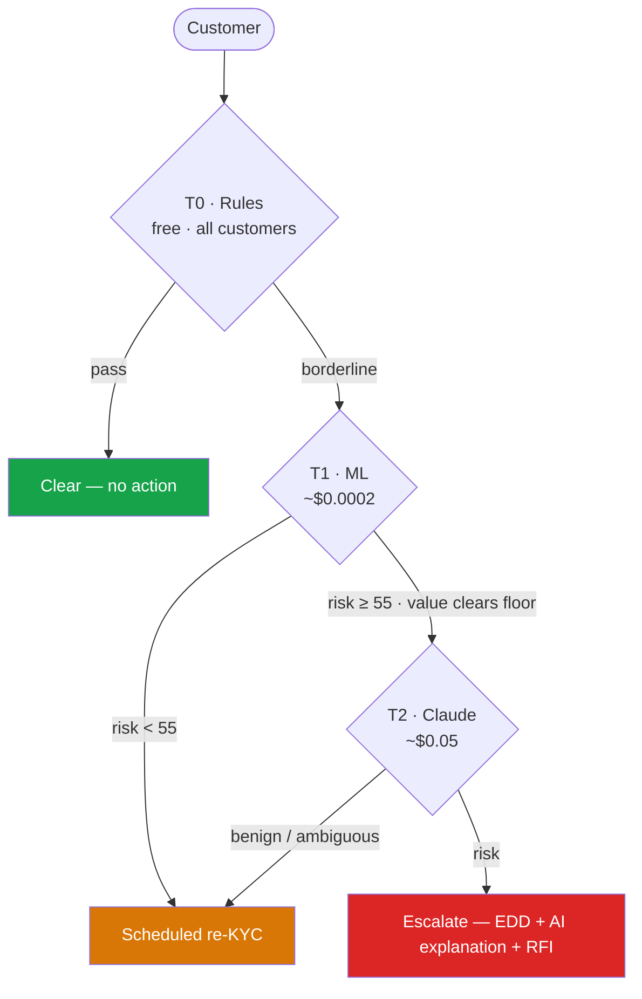

# Drift Engine — Technical Specification

Bayesian KYC drift detection for FINMA-regulated banks: the analysis layers, the
score fusion, the regulatory floors, the cost cascade, and how it's validated.
For the product overview see the main [README](../README.md); for the 10 use
cases see [use-cases.md](use-cases.md).

---

## The reframe

A KYC profile is not a document — it is a snapshot of the parameters of a
stochastic process, taken at onboarding. The customer is the process; the profile
is a frozen estimate. **Drift is the divergence between the frozen declared model
and the evolving observed trajectory.**

The question shifts from *"did something bad happen?"* to *"has the generative
process behind this customer's behaviour changed?"* — a well-posed statistical
question. Sanctions are the lagging consequence; drift is the leading precursor.
The bank's structural advantage is that it holds **both** the declared model
(original KYC) and the full observed trajectory (every transaction); no drifting
customer can fake consistency between the two over time.

---

## The layers

Each subject is scored by nine orthogonal layers in `backend/app/drift/`,
orchestrated by `service.py` and routed by a cost-aware cascade. Seven produce
score signals; one (public intelligence) fuses external evidence; one (the
cascade) routes for cost.

| # | Layer | File | Detects |
|---|---|---|---|
| 1 | Behavioral drift (BOCPD) | `bocpd.py` | Regime change in the transaction stream |
| 2 | Drift velocity | `velocity.py` | The *rate* of divergence from onboarding (leading) |
| 3 | Ownership contagion | `contagion.py` | Risk propagating through the ownership graph |
| 4 | Causal drift | `causal.py` | Risk-shaped change vs benign business growth |
| 5 | Suspicious stability | `stability.py` | The slow-walker who stays *too* smooth |
| 6 | Dormancy break | `dormancy.py` | A dormant shell suddenly activating |
| 7 | Business-model drift | `business_model.py` | A silent website/business pivot (UC9/UC10) |
| 8 | Public intelligence | `public_intel.py` | External signals + confirmation-lift fusion |
| 9 | Cost-aware cascade | `cascade.py` | T0 rules → T1 ML → T2 Claude routing |

---

## 1 · Behavioral drift (BOCPD)

Bayesian Online Changepoint Detection (Adams & MacKay, 2007) maintains a
posterior over the **run length** `r_t` — observations since the last regime
change — with a Normal-Inverse-Gamma conjugate model (Student-t posterior
predictive) and a constant hazard `H = 1/500` (≈ one regime change per business
year).

A changepoint manifests as a sharp **drop in the MAP run length**, not as
`P(r=0)` crossing a threshold. This is exactly why the detector catches gradual
drift that threshold rules structurally miss: a customer who raised average
volume 5K→9K over six months never crosses a 10K threshold, but the distribution
shift is plain to the run-length posterior. BOCPD runs over the daily volume
series, so its changepoint is a **day index** (`bocpd_changepoint_day`); the UI
maps it to its month and draws a violet dashed *"Regime change"* marker on the
timeline.

## 2 · Drift velocity

With `P_0` the onboarding profile and `P_t` the current estimate:

```
Drift(t) = KL( P_0 || P_t )      accumulated divergence, bits
DV(t)    = d/dt Drift(t)         drift velocity, bits per month
```

Each monitored metric (volume, counterparty-risk mix, corridor mix, frequency) is
a Gaussian per window; the closed-form Gaussian KL is summed across metrics, then
smoothed before differentiation. Robustness choice: the KL uses the **baseline
variance on both sides** (mean-shift KL), because per-window variance over ~21
daily points is too noisy. Velocity is a **leading** indicator; accumulated drift
is lagging — a customer shows velocity months before absolute divergence crosses
any sane threshold.

## 3 · Ownership contagion

Risk propagates from flagged entities `S` to customer `i` via personalized
PageRank with the teleport vector on `S` (`alpha = 0.85`), over a stake-weighted
undirected view so risk flows both ways. Customers two ownership hops from a newly
sanctioned entity are elevated **before** any list contains their name.

**Graph source.** In live mode `DriftEngine._build_ownership_graph` fetches each
customer's real GLEIF ownership chain (ultimate-parent + direct-child LEIs) and
builds the graph via `contagion.build_graph_from_snapshots`; shared LEIs link
customers into one topology. Offline, or when GLEIF resolves no links, it degrades
to the synthetic `build_demo_graph`. The GLEIF chain is also diffed against the
GLEIF KYC baseline to emit `ownership_change` public signals (UC3/UC8).

## 4 · Causal drift

Selling a business and becoming a laundering conduit move the same metrics — but
have different **correlation signatures**:

- **Benign growth** — volume up, margin preserved, counterparties stay clean.
- **Risk transit** — volume up, margin collapses (money flows straight through),
  counterparties concentrate, corridors shift high-risk.

Two hypotheses compete via a likelihood ratio:

```
causal_LLR = log P(signature | RISK) / P(signature | BENIGN)
```

Margin is the discriminator (kept orthogonal to velocity). Outputs `causal_llr`,
`p_risk`, and a `label` (`risk` / `benign` / `ambiguous`). Clearly-benign drift is
demoted out of the alert queue; risk-shaped drift is confirmed. A
`scale_jump_ratio` (active-window volume ÷ baseline) ≥ 5× **and** a co-occurring
`funding_event` signal adds a fixed LLR boost (UC6 — the FTX "raise that the
volumes never matched" pattern).

## 5 · Suspicious stability

Every other layer hunts movement; a launderer who knows drift is monitored does
the opposite and stays smooth. But real customers jitter — an unnaturally smooth
trajectory **while the environment moves** is itself anomalous:

```
suspicion = stability_anomaly × environmental_movement
```

A product, not a sum — both must be present. Stability is the coefficient of
variation vs the cohort median (scale-free). A flagged slow-walker is elevated so
it cannot hide below the radar.

## 6 · Dormancy break

The mirror of suspicious stability. A dormant shell is near-zero for a long
stretch, then bursts — and because the baseline is so quiet, the magnitude layers
under-react. `dormancy.py` detects it explicitly (pure NumPy):

```
dormancy_break = dormancy_depth × activation_strength
```

`dormancy_depth` = how quiet the baseline was; `activation_strength` = how large
the later burst is vs that baseline (a small floor stops a near-zero baseline
exploding the ratio). A product: stay-dormant ≈ 0, always-active-and-grew ≈ 0
(ordinary drift); only the dormant→active transition scores high (UC0 — the
Azerbaijani-Laundromat reactivation pattern).

## 7 · Business-model drift (website pivot)

UC9/UC10. A company can quietly change what it *does* without any transaction
signal — an advisory firm relaunches as a crypto exchange. `business_model.py`
compares the **onboarding website** (Wayback snapshot at the KYC date) against the
**current website** (Firecrawl scrape), embeds both with **model2vec** static
embeddings (pure NumPy, no torch, fully offline), and emits a
`business_model_change` signal when:

```
cosine_distance ≥ BUSINESS_MODEL_DISTANCE_THRESHOLD (0.35)
severity = clip(0.20 + 1.30 × cosine_distance, 0.0, 0.95)
```

In live mode the two texts are real (see [live-entities.md](live-entities.md)),
and a one-line LLM summary of *what changed* is generated (and cached) for the
side-by-side UI panel. Offline, the `domain_pivot` scenario supplies the texts.

## 8 · Public intelligence + confirmation lift

`public_intel.py` aggregates every source adapter's signals (news, adverse media,
sanctions, ownership/name/jurisdiction/domain changes, funding events, corridor
alerts), classifies severity by lexicon, and fuses them with internal drift.

**News-volume spike (UC1).** BOCPD runs over a weekly event-count series built
from the news signals (`detect_news_spike_month`); a *sustained* rise (the
Wirecard pattern) registers as a regime change whose onset anchors the
confirmation-lift window. The news source is selected once: **Event Registry**
when `EVENT_REGISTRY_API_KEY` is set, **GDELT** as the free fallback.

**Confirmation lift** is the differentiator — two weak, independent signals that
co-occur in time are worth more together than apart:

```
Lift = P(risk | public ∧ internal) / [ P(risk | public) · P(risk | internal) ]
```

A temporal-coincidence factor amplifies the joint when peak public signal and
peak internal drift fall within a few months (the same event seen from two
sides). It is **gated**: meaningful only when both signals clear a floor — two
near-zero risks coinciding is the absence of evidence, not its presence. The
hand-tuned fusion weights live in `app/core/config.py`:

| Constant | Value | Role |
|---|---:|---|
| `DRIFT_INTERNAL_VELOCITY_WEIGHT` | 0.60 | Leading drift contribution |
| `DRIFT_INTERNAL_ACCUMULATED_WEIGHT` | 0.25 | Accumulated divergence |
| `DRIFT_INTERNAL_CONTAGION_WEIGHT` | 0.40 | Ownership-propagated risk |
| `DRIFT_PUBLIC_RISK_WEIGHT` | 0.85 | Public-risk scaling before fusion |
| `DRIFT_CONFIRMATION_LIFT_RANGE` | 3.0 | Lift excess → amplification range |
| `DRIFT_CONFIRMATION_MAX_AMPLIFICATION` | 0.35 | Max confirmation-lift increase |

## 9 · Cost-aware cascade

Escalation as information economics: `escalate iff E[information gain] · case_value
> cost(next tier)`.



T2 adjudication is a real path in `service.py`: every `T2_LLM` customer goes
through the shared `AnthropicClient` (real Claude when a key is configured,
disk-cached; deterministic mock otherwise). The scan report keeps
`llm_on_everything_cost` as a counterfactual and separately reports
`actual_t2_llm_calls`, `real_t2_llm_calls`, `mock_t2_llm_calls`, `tokens_used`,
and `model`. **Result: ~94% cost reduction vs LLM-on-everything at equal
high-risk recall** (H4, validated on the synthetic book — see
[live-entities.md](live-entities.md) for how the LLM is cached).

---

## Score fusion

```
internal_risk = 0.60 · velocity_norm + 0.25 · accumulated_norm + 0.40 · contagion
public_risk   = severity-weighted aggregate of public signals
base          = max(internal_risk, public_risk × 0.85)
score (0–100) = min(base × (1 + confirmation_amplification), 1.0) × 100
```

When a trained drift XGBoost model is present, its probability is blended
(60% heuristic + 40% ML) **before** the floors below — so the model can never
lower a regulatory floor.

## Regulatory floors (cannot hide below the radar)

Mandatory escalations applied after the ML blend, in `service.py`:

| Floor | Value | Fires on | UC |
|---|---:|---|---|
| Suspicious-stability elevation | `50 + suspicion·40` | flagged slow-walker | — |
| Dormancy-break elevation | `55 + dormancy_break·35` | dormant→active | UC0 |
| Re-KYC floor (`RE_KYC_SCORE_FLOOR`) | **50** | `jurisdiction_change` / `legal_form_change` | UC4/UC7 |
| Sanctions floor (`SANCTIONS_SCORE_FLOOR`) | **90** | definitive OFAC/EU/SECO hit on the entity or a new UBO | UC5/UC8 |
| Name-change floor | **60** | confirmed `name_change` (re-KYC) | UC4/UC8 |

A jurisdiction/legal-form change or a sanctioned UBO can sit behind a perfectly
smooth transaction stream; the floors make the registry/sanctions fact surface
regardless of behaviour. (`requires_re_kyc_floor`, `is_definitively_sanctioned`,
and the `name_change` predicate are pure functions, unit-tested in
`test_score_boundaries.py`.)

---

## Time-travel replay

A regulatory-grade property: replay any customer **as-of** month `T` using only
data available then. BOCPD is online by construction (left-to-right, no future
data), which makes truncation honest. `timetravel.py` cuts all future sources —
metrics to `[:T]`, public signals by date, contagion only after the listing month
— and does **not** apply confirmation lift or the anomaly floors. This proves the
system would have flagged a customer early with no look-ahead bias.

---

## Validation

Each hypothesis is pinned by an executable test; run `docker compose run --rm
backend-tests`.

| Hypothesis | Result | Test |
|---|---|---|
| H1 — lead time | 2–7 months ahead, 0 false positives on stable customers | `test_hypothesis_h1.py` |
| H2 — velocity leads level | velocity fires earlier at equal FP rate | `test_hypothesis_h2.py` |
| H3 — contagion propagates | 2-hop customers elevated; distant unaffected | `test_hypothesis_h3.py` |
| H4 — cascade cost | < 10% of LLM-on-all at equal high-risk recall | `test_hypothesis_h4.py` |
| Causal classification | ground-truth scenarios, seed-robust | `test_causal.py` |
| Stability classification | ground-truth scenarios, seed-robust | `test_stability.py` |
| Time-travel honesty | no future data reaches the score | `tests/features/time_travel.feature` |

The suite is ~43 files; current status is 975 passing with 6 pre-existing
in-memory-DB-isolation failures unrelated to engine logic.

---

## Runtime note

The synthetic book and injected scenarios live in a process-local `DriftEngine`
singleton, so the API runs with **one** uvicorn worker (the Docker/Compose
commands already do). `get_drift_engine()` warns on singleton creation to make
this constraint visible before any multi-worker scaling.

---

## References

Adams & MacKay (2007), *Bayesian Online Changepoint Detection*, arXiv:0710.3742 ·
Page (1954), *Continuous Inspection Schemes*, Biometrika 41 · Kullback & Leibler
(1951), *On Information and Sufficiency* · Page, Brin, Motwani & Winograd (1999),
*The PageRank Citation Ranking* · Howard (1966), *Information Value Theory*, IEEE ·
FATF (2023), *Guidance on Beneficial Ownership* · FINMA Circular 2024/3,
*Operational risks and resilience*.
