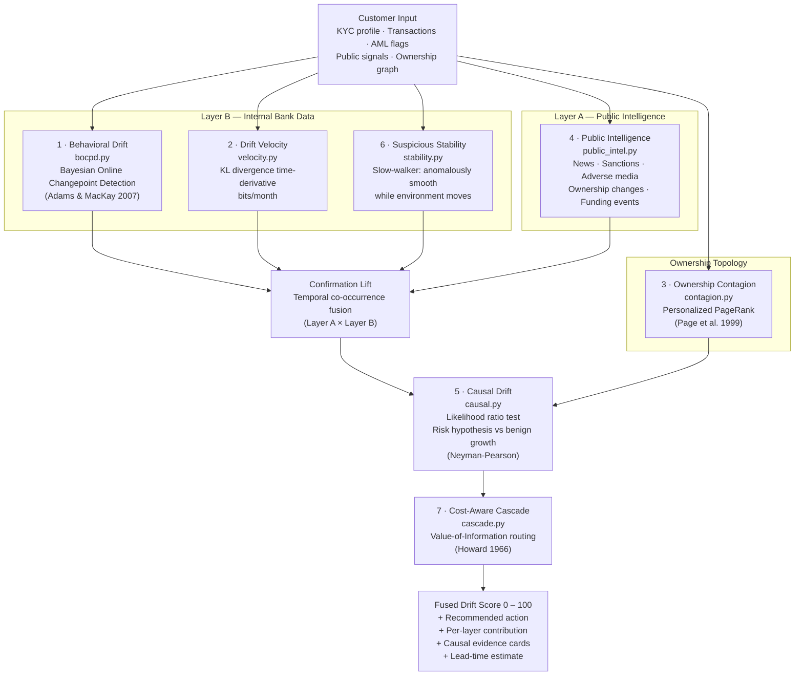
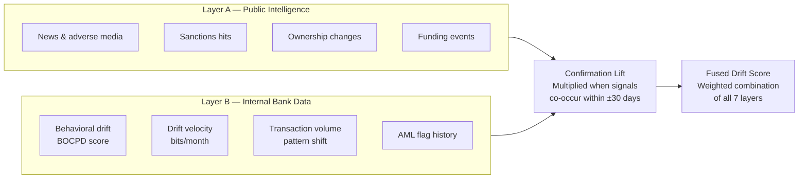
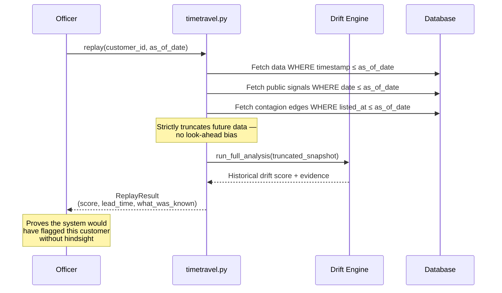

# Drift Engine — Technical Specification

Bayesian KYC drift detection for FINMA-regulated banks. Diagrams, mathematics, and validation results for each layer.

For the product overview see the main [README](../README.md).

---

## The Reframe

A KYC profile is not a document — it is a snapshot of the parameters of a stochastic process, taken at onboarding. The customer is the process; the profile is a frozen estimate. **Drift is the divergence between the frozen declared model and the evolving observed trajectory.**

The question shifts from *"did something bad happen?"* to *"has the generative process behind this customer's behavior changed?"* — a well-posed statistical question with decades of theory behind it. Sanctions are the lagging consequence; drift is the leading precursor.

The bank's structural advantage: it holds both the declared model (original KYC) and the full observed trajectory (every transaction). No drifting customer can fake consistency between the two over time.

---

## 7-Layer Pipeline



---

## Layer 1 — Behavioral Drift (BOCPD)

Bayesian Online Changepoint Detection (Adams & MacKay, 2007) maintains a posterior over the **run length** r_t — observations since the last regime change:

```
P(r_t | x_1:t)
```

with a Normal-Inverse-Gamma conjugate model giving a Student-t posterior predictive. A constant hazard H = 1/500 expresses a prior of roughly one regime change per business year.

**Detection.** In practice a changepoint manifests as a sharp **drop in the MAP run length** (posterior mass jumping to short runs), not as P(r=0) crossing a threshold — the mass spreads over r = 0..k. This distinction matters: it is why the detector catches gradual drift that threshold rules structurally miss. A customer who raised average volume from 5K to 9K over six months never crosses a 10K threshold, but the distribution shift is plainly visible to the run-length posterior.

---

## Layer 2 — Drift Velocity

Let P_0 be the onboarding profile distribution and P_t the current estimate:

```
Drift(t) = KL( P_0 || P_t )      accumulated divergence, in bits
DV(t)    = d/dt Drift(t)         drift velocity, bits per month
```

Each monitored metric is modeled as a Gaussian per window; the closed-form Gaussian KL is summed across metrics. A key robustness choice: the KL is evaluated with the **baseline variance on both sides** (mean-shift KL), because window-level variance estimates over ~21 daily observations are noisy and would otherwise drown the mean-shift signal. The drift trajectory is smoothed before differentiation, since differentiation amplifies noise.

Velocity is a **leading** indicator; accumulated drift is **lagging**. A customer can show meaningful velocity months before absolute divergence crosses any sane alert threshold.

---

## Layer 3 — Ownership Contagion

Ownership relations form a directed graph. When entities S become flagged, propagated risk for customer i is personalized PageRank with the teleport vector concentrated on S:

```
risk_prop(i) = PPR(i | personalization = S, alpha = 0.85)
```

computed over an undirected, stake-weighted view so risk flows both ways (an owner contaminates what it owns, and owning a flagged entity contaminates the owner). Customers two ownership hops from a newly sanctioned entity receive elevated risk **before** any list contains their name.

---

## Layer 4 — Public Intelligence + Confirmation Lift

Five public-signal categories (news, sanctions, adverse media, ownership changes, funding events) are classified by severity and aggregated into a public-risk score, severity- and recency-weighted.

Each public signal carries a `source` and optional `source_url`. In the MVP these URLs are deterministic demo references generated with the synthetic signal; real feed adapters can replace them with article, registry, or sanctions-record citations without changing the API.

**Confirmation Lift** is the differentiator. Two weak, independent signals that co-occur in time provide more evidence together than the product of their parts:

```
Lift = P(risk | public AND internal) / [ P(risk | public) · P(risk | internal) ]
```

A temporal-coincidence factor amplifies the joint when the peak public signal and peak internal drift fall within a few months — because the external story and the internal behavior are plausibly the same event seen from two sides. The lift is gated: it is only meaningful when **both** signals clear a floor; two near-zero risks coinciding is the absence of evidence, not its presence.

---

## Layer 5 — Causal Drift

Pure drift detection fires on any structural change. But selling a business and becoming a laundering conduit move the same metrics. The insight: benign and risky change have different **correlation signatures**, not different magnitudes.

- **Benign growth:** volume up, margin preserved, counterparties stay clean.
- **Risk transit:** volume up, margin collapses (money flows straight through), counterparties concentrate on risky, corridors shift high.

Two generative hypotheses compete via a likelihood ratio:

```
causal_LLR = log P(signature | RISK) / P(signature | BENIGN)
```

Margin is the discriminator (kept orthogonal to velocity). A forensic asymmetry applies: a metric sitting in its neutral zone does not argue *against* risk just because the risk profile expected movement there — absence of evidence is not evidence of absence. The verdict modulates the final score: clearly-benign drift is demoted out of the alert queue; risk-shaped drift is confirmed.

---

## Layer 6 — Suspicious Stability

Every other layer hunts for movement. A launderer who knows drift is monitored does the opposite: stays smooth. But real customers jitter; an unnaturally smooth trajectory **while the environment moves** is itself anomalous.

```
suspicion = stability_anomaly × environmental_movement
```

A product, not a sum — both factors must be present. Stability is measured by coefficient of variation versus the cohort median (scale-free). A flagged slow-walker has its score elevated so it cannot hide below the radar.

---

## Cost-Aware Cascade (Tier Router)

Escalation is framed as information economics:

```
escalate from tier k to k+1  iff  E[information gain] · case_value > cost(k+1)
```


**Result:** 96% cost reduction vs LLM-on-everything at equal high-risk recall (H4, validated on 1,000-customer synthetic book).

---

## Two-Layer Fusion



---

## Time-Travel Audit

A regulatory-grade property: replay any customer **as-of** month T using only data available then. BOCPD is online by construction (it processes the stream left-to-right and cannot use future data), which makes truncation honest rather than a hack. All future sources are cut: metrics to [:T], public signals by date, contagion only after the listing month. This proves the system would have flagged a customer early, with no look-ahead bias.



---

## Validation Results

| Hypothesis | Scenario | Result |
|---|---|---|
| H1 — Lead time | Changepoint on step data, none on stationary | 2–7 months lead (median 5.5), 0 false positives |
| H2 — Velocity leads level | Velocity vs absolute-threshold alerting | Velocity fires earlier at equal FP rate |
| H3 — Contagion propagates | Personalized PageRank from sanctioned seed | 2-hop customers elevated; distant unaffected |
| H4 — Cascade cost reduction | Cascade vs LLM-on-everything, 1,000 customers | 96% cost reduction at equal recall |
| Causal classification | 11 scenarios with ground truth | 11/11 correct, 8/8 seed robustness |
| Stability classification | 13 scenarios with ground truth | 13/13 correct, 8/8 seed robustness |
| Time-Travel honesty | 3 leak-detection tests | No future data reaches the score |

---

## References

- Adams, R. P. & MacKay, D. J. C. (2007). *Bayesian Online Changepoint Detection.* arXiv:0710.3742.
- Page, E. S. (1954). *Continuous Inspection Schemes.* Biometrika 41.
- Kullback, S. & Leibler, R. A. (1951). *On Information and Sufficiency.* Annals of Mathematical Statistics 22.
- Page, L., Brin, S., Motwani, R. & Winograd, T. (1999). *The PageRank Citation Ranking.* Stanford InfoLab.
- Howard, R. A. (1966). *Information Value Theory.* IEEE Trans. Systems Science and Cybernetics 2.
- Shafer, G. & Vovk, V. (2008). *A Tutorial on Conformal Prediction.* JMLR 9.
- FATF (2023). *Guidance on Beneficial Ownership of Legal Persons.*
- FINMA Circular 2024/3. *Operational risks and resilience — banks.*
