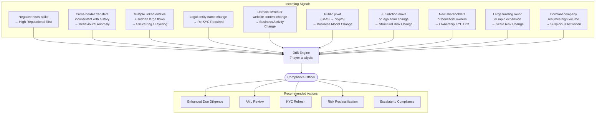
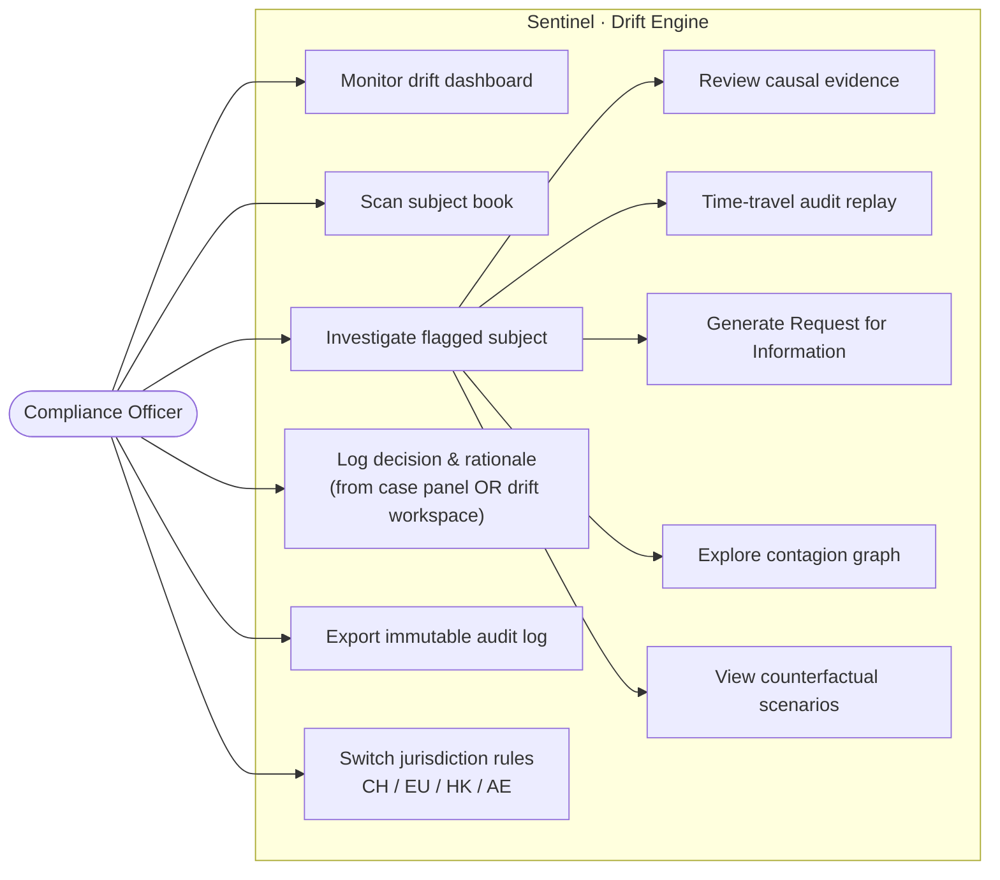
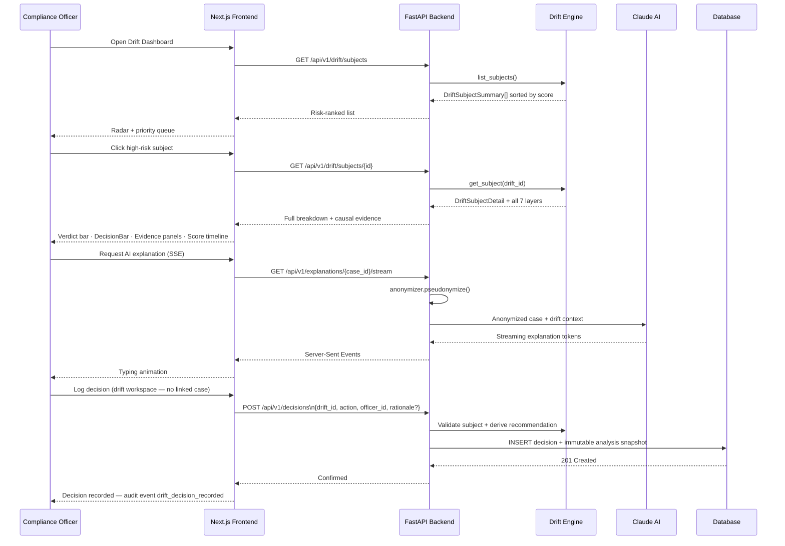
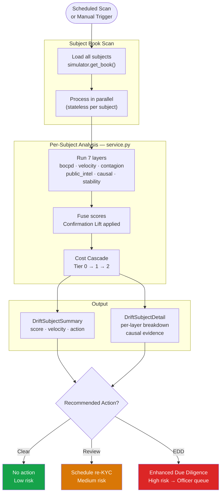
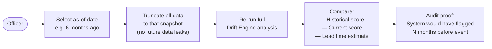
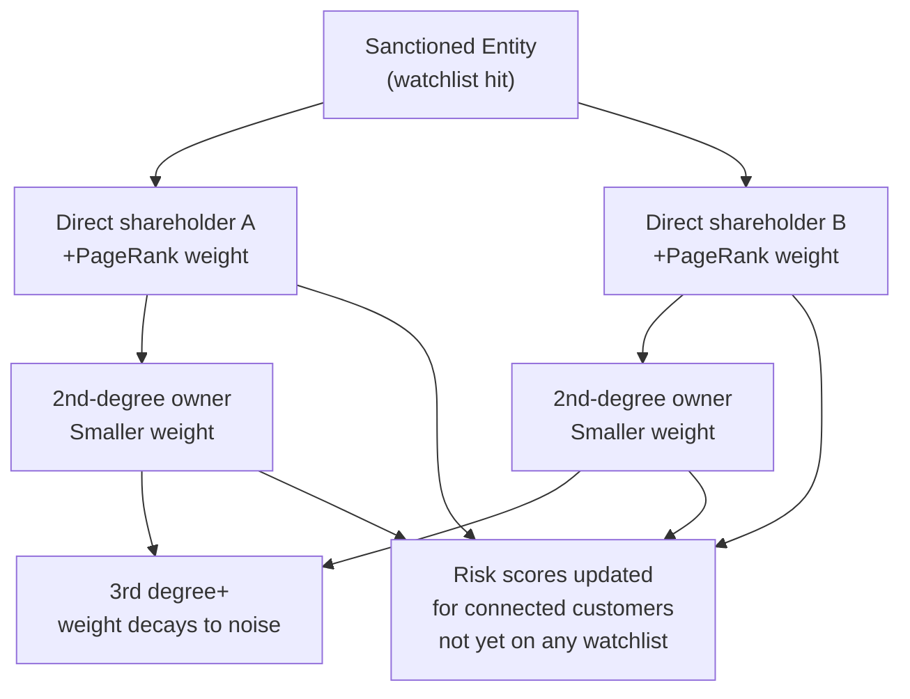

# User Flows & Use Cases

## Challenge Use Cases (from AMINA brief)

Ten specific signal scenarios the system must detect and action. See [CHALLENGE_4_OVERVIEW.md](CHALLENGE_4_OVERVIEW.md) for the full table.

**Coverage status:**
- ✅ S1 S2 S3 S7 S8 S9 S10 — fully covered by drift engine layers (S10 dormancy break via the explicit `dormancy.py` detector)
- ❌ S4 S5 S6 — entity name change, domain monitoring, and business model pivot not yet implemented

---

## System Use Cases (officer perspective)

---

## Officer Investigation Flow

---

## Drift Detection Flow

---

## Time-Travel Audit Flow

---

## Ownership Contagion Discovery

