# Sentinel — Source Integration Architecture

> Next-step design: how external registry, news, and web-monitoring connectors
> plug into the signal layer, how signals are rated, and how ML fusion produces
> the final drift score.
>
> Companion to [`architecture.md`](architecture.md) and [`drift-engine.md`](drift-engine.md).
> For the **free-vs-paid decision per source** and the current scaffolding
> status, see [`sources.md`](sources.md).

> **Status — scaffolding (carcass).** `backend/app/sources/` now exists with the
> shared contract (`RegistryAdapter`, `EntitySnapshot`, generic field-diff) and a
> carcass per source. No adapter does real network I/O yet. Of the connectors
> below, **7 are free and will be implemented** (ZEFIX, GLEIF, OpenSanctions,
> GDELT, Firecrawl, Wayback, WHOIS/RDAP) and **3 are paid and skipped**
> (OpenCorporates, Event Registry, Crunchbase). GDELT is the free, key-less news
> feed that replaces the paid Event Registry. Details + rationale in
> [`sources.md`](sources.md).

---

## 1. Current State vs. Target

```
TODAY                                  TARGET
─────────────────────────────────────  ─────────────────────────────────────
Synthetic customer book only           Real KYC baseline stored per customer
Template headlines (no real APIs)      Real source adapters (9 connectors)
Lexicon severity classifier            Severity = adapter-specific formula
XGBoost wired to CASE only             XGBoost wired to DRIFT feature vector
SHAP disconnected from drift           SHAP per-signal contribution in UI
"public_risk" = single float           Signal list with citations + months
```

---

## 2. Top-Level System Architecture

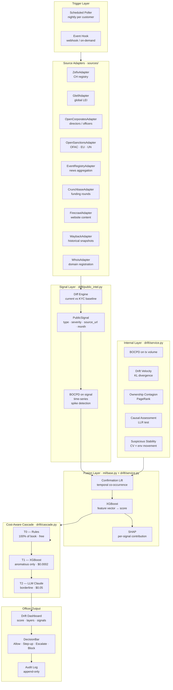

---

## 3. Source Adapter Pattern — One Base Class, Nine Implementations

Every external source follows the **fetch → normalize → diff → signal** pipeline.

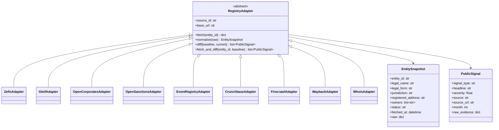

**Fetch → diff sequence (same for every adapter):**

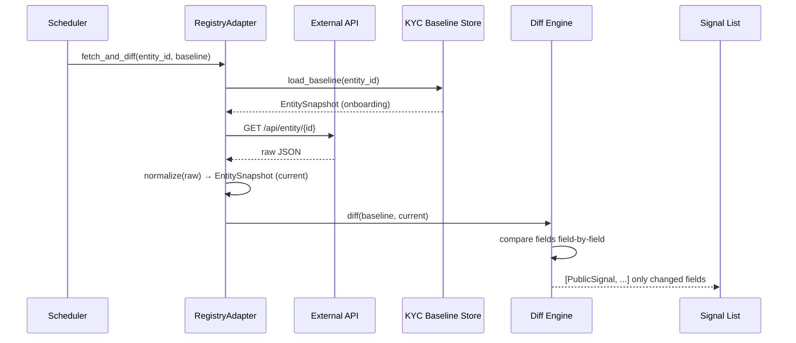

---

## 4. Per-Connector Detail

### 4a. ZEFIX — Swiss Commercial Register (Cases 4, 7, 8, 10)

API base: `https://www.zefix.admin.ch/ZefixPublicREST/api/v1` (free, no key)

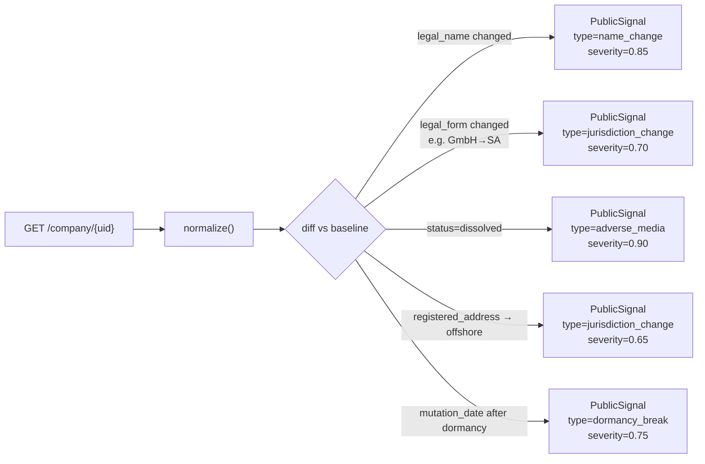

Fields tracked: `name`, `legalSeat`, `legalForm`, `status`, `uid`, `mutationDate`.

Severity formula for name change:
```
severity = 0.75 + 0.10 × (levenshtein_distance / max(len_a, len_b))
           capped at 0.90
```
Small typo corrections → ~0.76. Complete rebrand → 0.90.

---

### 4b. GLEIF — Global Legal Entity Identifier (Cases 3, 4, 5, 8, 10)

API base: `https://api.gleif.org/api/v1`

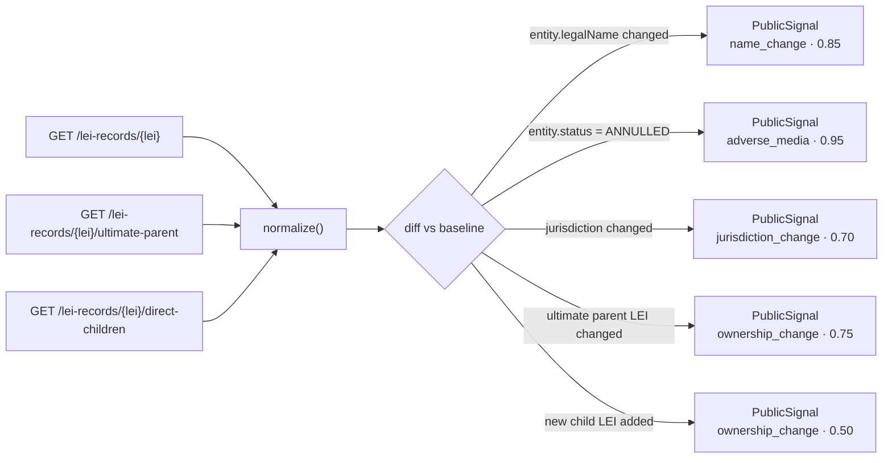

Key endpoints:
- `/lei-records/{lei}` — entity status, legal name, jurisdiction
- `/lei-records/{lei}/ultimate-parent` — top-of-chain UBO entity
- `/lei-records/{lei}/direct-children` — subsidiaries
- `/lei-records?filter[entity.legalName]=...` — reverse name lookup

---

### 4c. OpenSanctions — Watchlist Screening (Cases 2, 5)

API base: `https://api.opensanctions.org` — free tier, 30 req/min.

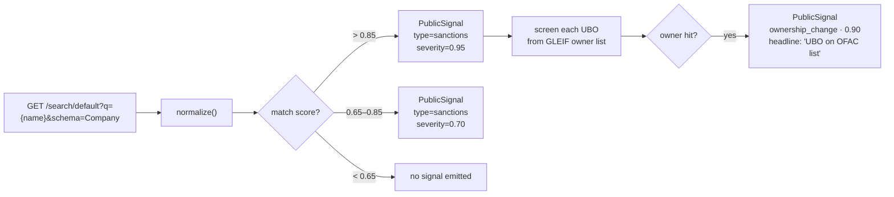

Match score comes from OpenSanctions' built-in name-matching engine.
Threshold 0.85 → ~99% precision on entity names.

---

### 4d. EventRegistry — News Event Aggregation (Cases 1, 6, 8, 10)

EventRegistry groups 20–50 articles into a single `Event` object, so spike
detection operates on event-level aggregation rather than raw article count —
much more robust against SEO noise and syndication spam.

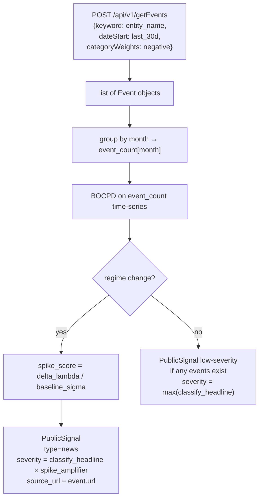

Severity classification — two-stage pipeline:

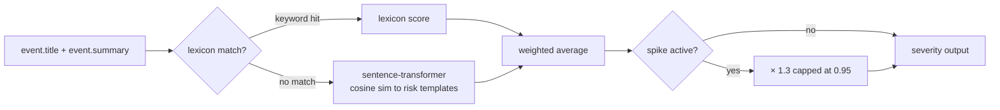

---

### 4e. Crunchbase — Funding & Scale Events (Case 6)

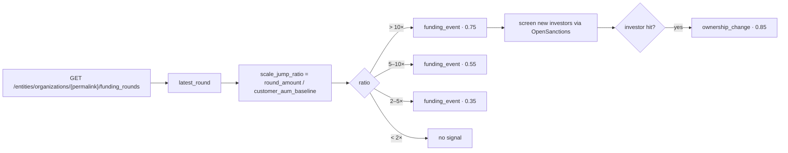

---

### 4f. Firecrawl + Wayback Machine — Website Content Drift (Cases 9, 10)

The most complex connector: uses embedding comparison rather than field diffing.

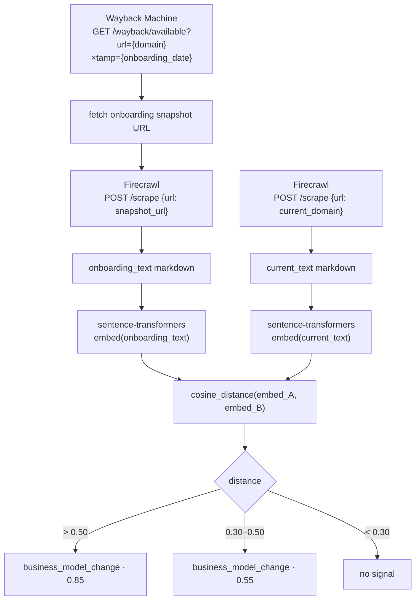

---

### 4g. WHOIS / RDAP — Domain Registration (Case 9)

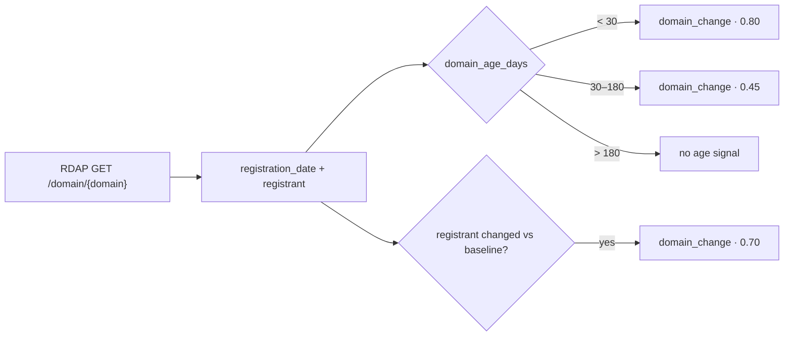

---

## 5. Signal Schema and Severity Scale

Every adapter emits the same `PublicSignal`. After the migration, `public_intel.py`
becomes an **aggregator** that calls adapters rather than generating templates.

| Severity | Meaning | Examples |
|---|---|---|
| 0.90–1.00 | Near-certain escalation trigger | OpenSanctions hit, entity ANNULLED |
| 0.75–0.89 | Strong — high priority | Legal name change, domain age < 30d |
| 0.60–0.74 | Moderate — investigate | Jurisdiction move, parent LEI changed |
| 0.40–0.59 | Informational — monitor | New subsidiary, small funding round |
| 0.10–0.39 | Background noise | Awards, partnerships, minor press |
| 0.00 | Suppressed | Confirmed typo correction |

**Severity formulas per signal type:**

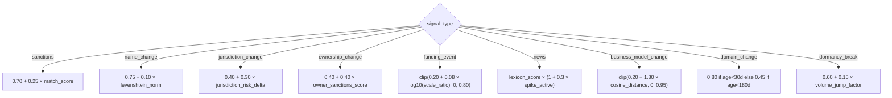

---

## 6. BOCPD Applied to Public Signal Time-Series

BOCPD already runs on internal transaction volume. The same algorithm wraps
the news event-count time-series for spike detection (Use Case 1).

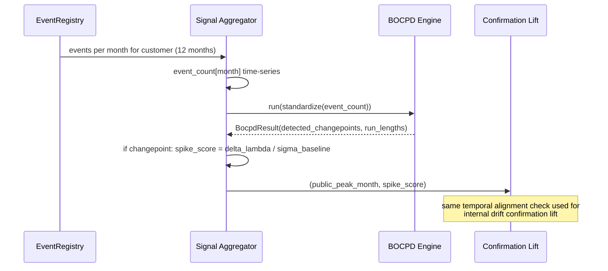

This means the existing confirmation-lift gate handles news spikes automatically:
if the internal BOCPD fires on volume **and** the news BOCPD fires on event count
within the same 30-day window, lift amplifies both signals.

---

## 7. Full Fusion Pipeline — How a Score Is Built

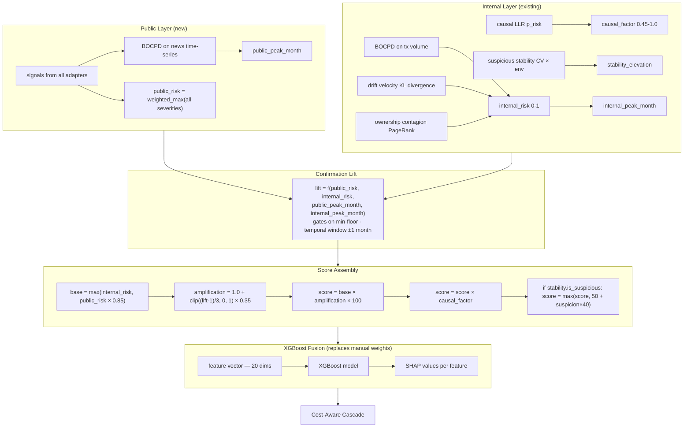

---

## 8. XGBoost Feature Vector — What Goes In

The existing XGBoost model scores **cases** via a case feature extractor.
A parallel `DriftFeatureExtractor` feeds the same `RiskModel` class for drift.

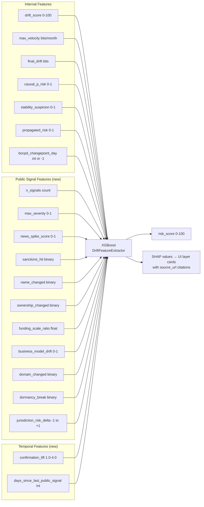

**Why XGBoost replaces manual weights:** `service.py` currently uses 6 hardcoded
magic-number weights (`0.6 × vel_norm + 0.25 × drift_norm + 0.4 × prop_risk`).
With 20 real features these weights become unmanageable and opaque. XGBoost
learns interaction weights from the labeled synthetic book (ground-truth scenarios),
and SHAP makes each weight explainable — the officer sees "score driven 40% by
`news_spike`, 30% by `ownership_changed`, 20% by `drift_velocity`."

**Training setup:**
- Data: 7 synthetic scenarios × multiple time windows ≈ 200 labeled samples
- Labels: `{risk, benign, ambiguous}` from simulator ground truth
- Model: `XGBClassifier` + Platt scaling → probability → 0–100 score
- SHAP: `TreeExplainer(model).shap_values(feature_vector)` → per-feature contribution list

---

## 9. SHAP → UI Layer Cards

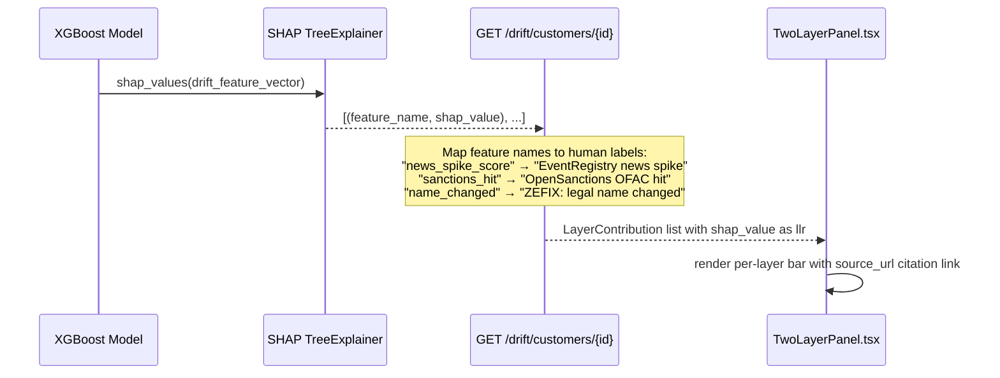

---

## 10. Cost-Aware Cascade — Full Decision Tree

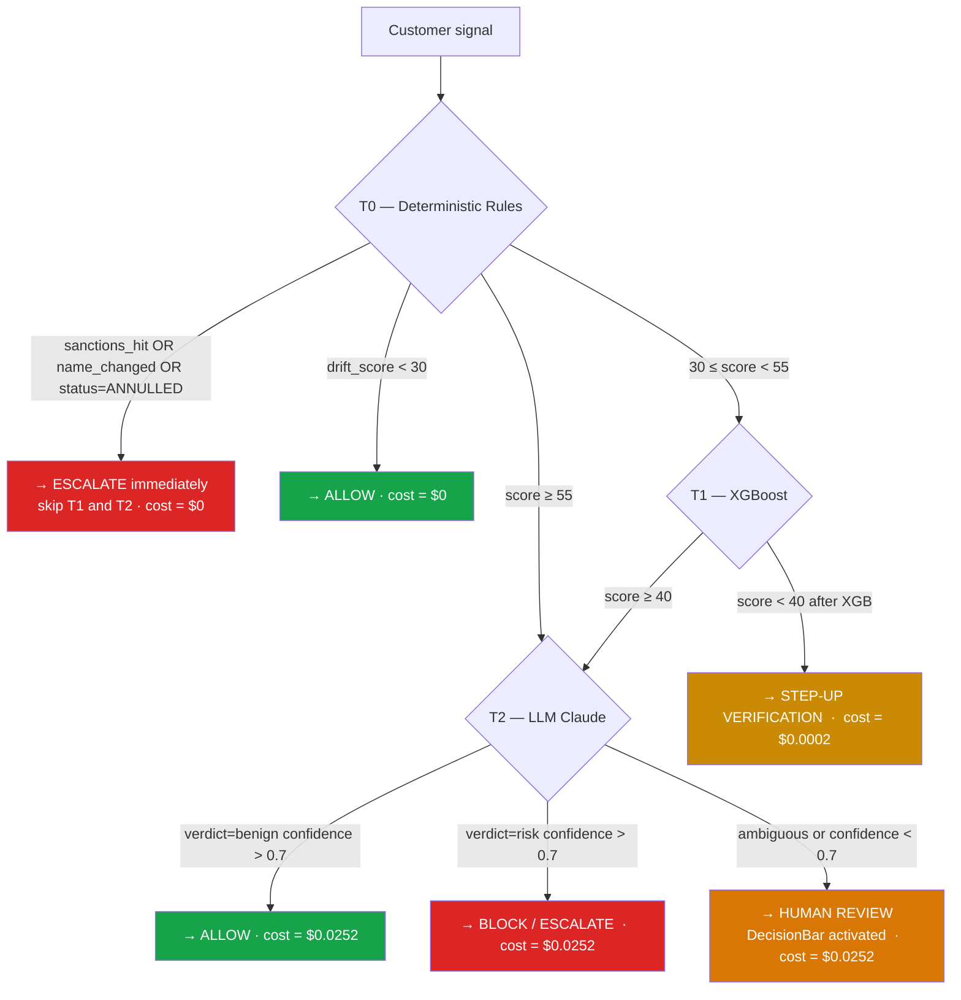

---

## 11. End-to-End Flow — Use Case 8: Legal Entity Name Change

*Swiss company secretly renamed — one of the three previously-missing use cases.*

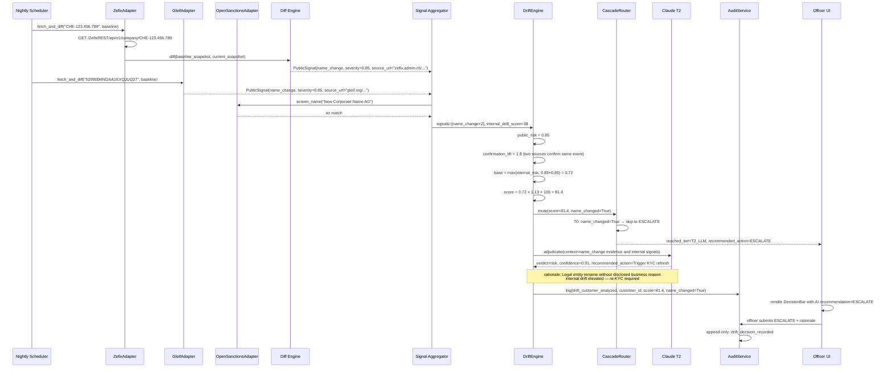

---

## 12. Sprint Sequence — Ordered by Impact

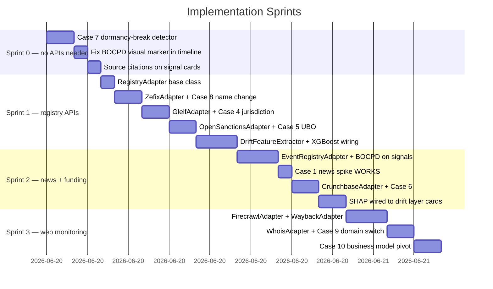

---

## 13. File Layout — What Gets Created

```
backend/app/
├── sources/                        ← NEW package (carcass — scaffolding only)
│   ├── __init__.py                 ← exports contract + adapters + registry
│   ├── base.py                     ← RegistryAdapter ABC + EntitySnapshot +
│   │                                  PublicSignal + SnapshotDiff/diff_snapshots
│   ├── cost.py                     ← SourceCost/AdapterStatus + CostMixin +
│   │                                  SourceUnavailableError (free-vs-paid layer)
│   ├── registry.py                 ← REGISTRY catalogue + usable/skipped helpers
│   ├── zefix.py                    ← ZefixAdapter            (FREE  · implement)
│   ├── gleif.py                    ← GleifAdapter            (FREE  · implement)
│   ├── opensanctions.py            ← OpenSanctionsAdapter    (FREEMIUM · implement)
│   ├── gdelt.py                    ← GdeltAdapter  NEW       (FREE  · implement)
│   ├── firecrawl.py                ← FirecrawlAdapter        (FREEMIUM · implement)
│   ├── wayback.py                  ← WaybackAdapter          (FREE  · implement)
│   ├── whois.py                    ← WhoisAdapter            (FREE  · implement)
│   ├── open_corporates.py          ← OpenCorporatesAdapter   (PAID  · SKIPPED)
│   ├── event_registry.py           ← EventRegistryAdapter    (PAID  · SKIPPED)
│   └── crunchbase.py               ← CrunchbaseAdapter       (PAID  · SKIPPED)
│
├── drift/
│   ├── public_intel.py             ← becomes aggregation layer not generation
│   ├── dormancy.py                 ← NEW: explicit dormancy-break detector
│   └── business_model.py           ← NEW: sentence-transformer cosine comparator
│
├── ml/
│   └── extractors/
│       ├── social_engineering.py   (existing)
│       └── drift.py                ← NEW: DriftFeatureExtractor (20 features)
│
└── db/
    └── kyc_baseline.py             ← NEW: store/load EntitySnapshot per customer
```

---

## 14. Source → Use Case Coverage Matrix

| Source | Use Cases | Cost | Decision |
|---|---|---|---|
| ZEFIX | 4, 7, 8, 10 | FREE | ✅ implement |
| GLEIF | 3, 4, 5, 8, 10 | FREE | ✅ implement |
| OpenSanctions | 2, 5 | FREEMIUM | ✅ implement |
| GDELT | 1, 6, 8, 10 | FREE | ✅ implement (replaces Event Registry) |
| Firecrawl | 9, 10 | FREEMIUM | ✅ implement |
| Wayback Machine | 9, 10 | FREE | ✅ implement |
| RDAP / WHOIS | 8, 9 | FREE | ✅ implement |
| OpenCorporates | 3, 4, 5, 7 | PAID | ⛔ skip (covered by GLEIF + ZEFIX) |
| EventRegistry / NewsAPI.ai | 1, 6, 8, 10 | PAID | ⛔ skip (covered by GDELT) |
| Crunchbase | 6 | PAID | ⛔ skip (partial via GDELT news) |
| Internal transactions | 2, 3, 7 | — | already built |

After the free sprints: **10/10 use cases covered with 7 free adapters** (no paid
dependency), up from 1 fully working today.
